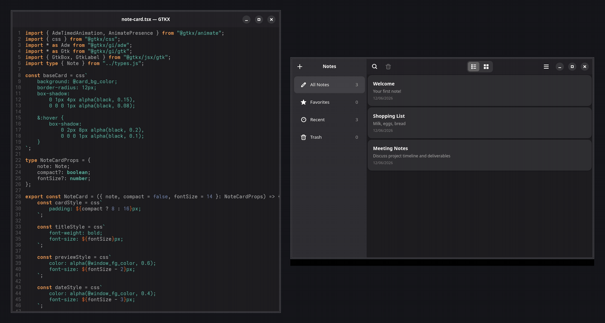

<p align="center">
  
</p>

# gtkx

gtkx is a framework for building native GTK4/libadwaita desktop applications with React, TypeScript, and JSX. You write declarative JSX whose element types are GTK widget names; a custom react-reconciler maps that tree to live GObject instances, while a Rust napi addon owns the single GLib main-loop thread and performs every call into GTK. A build-time generator turns GObject-Introspection (GIR) XML into typed bindings, JSX element types, and reconciler metadata, and a Vite-based CLI provides scaffolding, a hot-reloading dev server, single-file production bundling, and GTK-asset integration.

Homepage: [gtkx.dev](https://gtkx.dev)



## Prerequisites

This is a Linux desktop framework, not a browser/DOM renderer. You need:

- **Node.js** — the engines floor is Node `>=24`.
- **pnpm** — the workspace package manager, provisioned via Corepack from the `packageManager` field.
- **Rust toolchain** — 2024 edition with a C linker, plus the napi-rs CLI and Node N-API headers, to compile the native addon. A nightly toolchain is additionally required for the coverage, asan, and miri paths.
- **libffi** — for dynamic CIF construction and closures in the native addon.
- **GTK4 and libadwaita** development libraries, plus the broader GNOME library set the examples use (GtkSourceView, WebKitGTK, VTE, GStreamer, etc.), with `pkg-config`.
- **GLib/GObject** shared libraries present at build and run time; gtkx resolves GTK symbols dynamically by name.
- **GObject-Introspection** development data and system GIR files (read by codegen), plus `glib-compile-resources` and `glib-compile-schemas` for asset compilation.
- **A headless Wayland compositor** (Weston, or Sway when `GTKX_COMPOSITOR=sway`) and software GL/Vulkan rasterization to run GTK tests and benches without a GPU.
- **git**, for repository initialization during scaffolding.

For the containerized CI path you additionally need Docker; the CI image pins the full GTK/Rust/Node toolchain.

## Getting started

```sh
git clone https://github.com/gtkx-org/gtkx.git
cd gtkx
corepack enable
pnpm install
pnpm build
```

`pnpm build` runs the Rust `native-build` and `@gtkx/cli#codegen` first (hard Turbo upstreams), so the first build compiles the addon and generates the `@gtkx/gi`/`@gtkx/jsx` binding stores before any TypeScript package builds.

## Common commands

All root scripts run through Turbo over the workspace (the root meta-package is excluded with `--filter=!gtkx`).

| Command | Description |
| --- | --- |
| `pnpm build` | Build all workspace packages (runs codegen + native-build first). |
| `pnpm --filter <pkg> dev` | Start a package/example dev server (hot-reloading `gtkx dev`); see [Running the examples](#running-the-examples). There is no root `dev` script. |
| `pnpm test` | Run the Vitest workspace plus per-package test scripts. |
| `pnpm typecheck` | Type-check every package via `tsc -b --emitDeclarationOnly` across the reference graph. |
| `pnpm lint` | Full quality gate: ts-reference drift check, biome, knip (default + production), dependency-cruiser, plus per-package lint (Rust fmt/clippy on native). |
| `pnpm codegen` | Generate/refresh the `.gtkx` GIR and JSX binding stores consumed by other packages. |
| `pnpm coverage` | Aggregated v8 lcov coverage (TS) plus native Rust coverage. |
| `pnpm sync:ts-refs` | Rewrite TypeScript project references from `package.json` deps and format them (add `--check` to fail on drift). |
| `pnpm asan` / `pnpm miri` / `pnpm bench` | Native AddressSanitizer suite, Miri marshalling subset, and CodSpeed benchmarks under the headless compositor. |
| `pnpm release` | Build, inject README into published packages, stage native artifacts, and publish to npm. |
| `pnpm publish-test` | Publish to an ephemeral Verdaccio registry, then scaffold, build, typecheck, and test a consumer app end-to-end. |

To run tests for a single package, filter through Turbo or pnpm, for example:

```sh
pnpm --filter @gtkx/ffi test
pnpm --filter @gtkx/react test
pnpm --filter @gtkx/cli build
```

## Running the examples

Each example exposes the standard `dev`, `build`, and `start` scripts that wrap the CLI (`gtkx dev` / `gtkx build` / `node dist/bundle.js`).

```sh
# Counter app demonstrating the basics
pnpm --filter hello-world dev

# Notes app from the tutorial (uses @gtkx/css and @gtkx/animate, GSettings via #data)
pnpm --filter tutorial dev

# GTK4 widget showcase (the React port of the official gtk-demo; the only example with tests)
pnpm --filter gtk-demo dev
pnpm --filter gtk-demo coverage

# Simple browser using WebKitWebView
pnpm --filter browser dev
```

Build and run any example's production bundle:

```sh
pnpm --filter hello-world build
pnpm --filter hello-world start
```

The tutorial additionally packages as a single executable (`pnpm --filter tutorial build:sea`) and as a Flatpak (`pnpm --filter tutorial build:flatpak`); these need esbuild, postject, and a Flatpak toolchain.

## Gotchas

- **codegen and native-build come first.** A clean checkout cannot type-check or build any TypeScript package until the Rust addon is compiled and codegen has produced `.gtkx`; both are hard Turbo upstreams. `pnpm lint` first creates the `.gtkx` symlink that knip and dependency-cruiser resolve against.
- **Generated packages are not hand-edited.** `@gtkx/gi`, `@gtkx/jsx`, and the generated `@gtkx/gl` sources come from `@gtkx/codegen`. Change the emitters or `gtkx.config.ts` and regenerate (`pnpm codegen`); the store swap is atomic, so partial writes never appear.
- **GTK tests/benches need a headless display.** Running native `test`/`coverage`/`asan` or the GTK suites outside the headless wrapper fails to initialize a display; the harness provisions a Wayland compositor with software rendering. Native tests run single-threaded because GTK requires a single owning thread.
- **The native runtime is single-use.** All GObject/GTK mutation runs only on the single `gtkx-glib` thread; native init is one-shot and quit is terminal, so a process cannot restart the runtime. Importing `@gtkx/ffi` starts the GLib main loop and registers a process exit handler.
- **Project references track deps.** TypeScript references are generated from `package.json` dependency fields by `sync-ts-references`; hand-editing them is reported as drift by the `--check` run in lint. Change deps, then run `pnpm sync:ts-refs`.
- **`@gtkx/testing` cleanup is not automatic.** Consumers must register `cleanup()` (the e2e setup wires it into `afterEach`/`afterAll`), or leaked windows persist across tests.
- **The dev loop restarts via exit code 75.** The dev supervisor and runner signal restart intent purely through process exit code 75; Fast Refresh applies only to SSR-transformed project files where every export looks like a React component, otherwise the whole process restarts.

## Documentation

Architecture and subsystem docs live under `docs/`:

- [`docs/architecture.md`](docs/architecture.md) — architecture overview and layer stack.
- [`docs/rendering.md`](docs/rendering.md) — the render and event pipeline.
- [`docs/codegen.md`](docs/codegen.md) — the GIR/Khronos code generator and the runtime contract.
- [`docs/cli.md`](docs/cli.md) — the CLI and project workflow.
- [`docs/styling.md`](docs/styling.md) — styling, animation, and GL.
- [`docs/mcp.md`](docs/mcp.md) — the MCP server.
- [`docs/testing.md`](docs/testing.md) — the testing architecture.
- [`docs/build-system.md`](docs/build-system.md) — the build system and quality tooling.

For an agent-oriented index of packages and the hard build rules, see [`CLAUDE.md`](CLAUDE.md).
