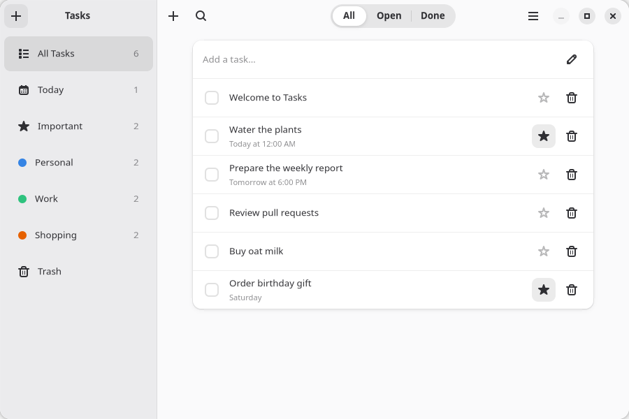

# tutorial

**Tasks**, the complete GNOME task manager built in the [GTKX tutorial](https://gtkx.dev/tutorial/). An adaptive split view navigator puts smart views (All Tasks, Today, Important, Trash) and user-created lists in a sidebar, next to a content pane that shows the task list, or the editor for the task you open.



## What it demonstrates

- Adaptive layout with `@gtkx/navigation`: a `createSplitViewNavigator` with `Lists` in the sidebar pane, and `Tasks` and `Task` as pages of the content stack. The selected list or smart view is the `Tasks` route's params, and the open task is the `Task` route's. An `AdwBreakpoint` drives the navigator's `collapsed` prop, folding the panes into one column on a narrow window.
- Native form state with `@gtkx/forms`: React Hook Form-backed `EntryRow` and `SwitchRow` controls keep a task title draft separate from its committed value while importance stays synchronized with the store.
- Settings backed by a GSettings schema (`data/com.gtkx.tutorial.gschema.xml`), read and written with `useSetting` and `useBindSetting`, driving the Adwaita color scheme through `Adw.StyleManager`.
- Actions, menus, and shortcuts: `GSimpleAction` elements wired to a menu button, `actionAccels`, and a `GtkShortcutController`.
- Dialogs and feedback: preferences, an about dialog, a shortcuts window, delete confirmation, and toasts via `AdwToastOverlay`.
- Styling with `@gtkx/css`, on top of the Adwaita style classes the widgets already carry.
- Desktop notifications built with `Gio.Notification`, including action buttons that route back into the app.
- Internationalization through react-i18next and GTKX's gettext backend, with upstream-generated resource types, a French PO catalog, translated freedesktop metadata, and MO files staged into every package format.
- Persistence to `$XDG_DATA_HOME` with the Node.js standard library: `node:fs` writes a temp file, then `renameSync` swaps it into place.
- Packaging: one `deploy` block in `gtkx.config.ts` turns the app into a localized Flatpak, a `.deb`, an `.rpm`, and an AppImage with `npm run deploy`. The command owns extraction, missing-catalog initialization, PO synchronization, MO compilation, metadata localization, staging, and packaging.

`gtkx.config.ts` uses the default GTK and Adwaita bindings.

## Run it

This example is deliberately excluded from the pnpm workspace. It installs `@gtkx/*` from the npm registry exactly as your own app would, so it uses **npm**:

```sh
npm install
npm run dev
```

`npm run build` writes `dist/bundle.mjs`, which `npm start` runs with Node.js. `npm run deploy` packages the app for distribution into `build/out/`.

To validate it against the packages in this repository instead of the published ones, run this from the repository root:

```sh
pnpm tutorial
```

That publishes the workspace packages to a local registry, then installs, builds, runs, and typechecks the example against them.

## Learn more

- [The tutorial](https://gtkx.dev/tutorial/), which tours this source file by file
- [Internationalization](https://gtkx.dev/tutorial/internationalization)
- [Packaging](https://gtkx.dev/tutorial/packaging)
