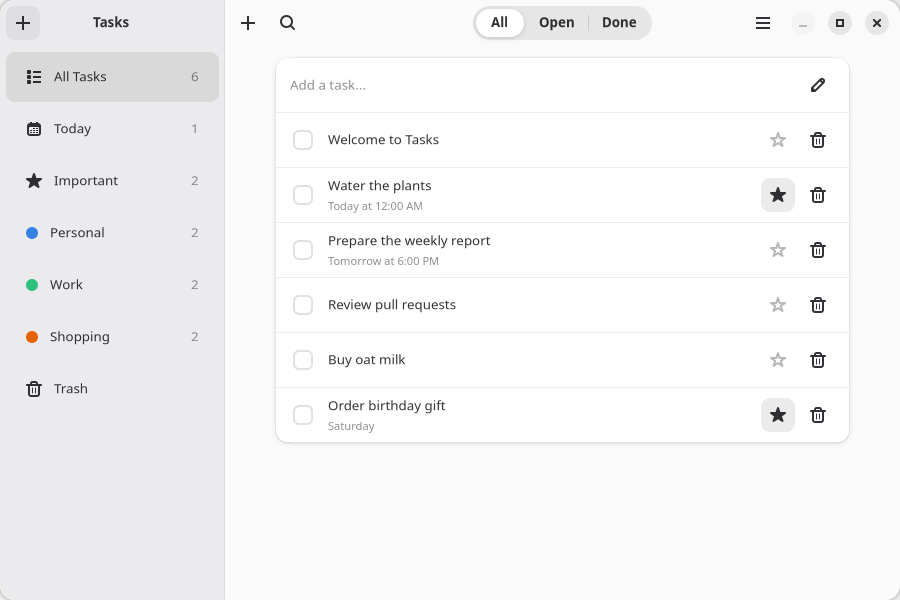

# Tasks

Tasks is the complete Linux application built by the [GTKX tutorial](https://gtkx.dev/v2/tutorial/). Its Adwaita foundation combines adaptive navigation, forms, settings, actions, dialogs, notifications, localization, persistence, testing, and Linux packaging.



This example is excluded from the pnpm workspace and consumes published packages like an external project:

```bash
npm install
npm run dev
```

Run `npm test` from this directory to exercise the application. See [desktop integration](https://gtkx.dev/v2/tutorial/actions-menus-shortcuts) and [packaging](https://gtkx.dev/v2/tutorial/packaging).
