<!-- Generated by scripts/gallery.ts from screenshots/gallery/manifest.ts. Do not edit by hand. -->

# Adwaita & feedback

Libadwaita patterns that make an app feel at home on GNOME: status pages, banners, toasts, and preference rows. Every screenshot below is captured from a real GTKX render of the source shown with it.

### AdwStatusPage

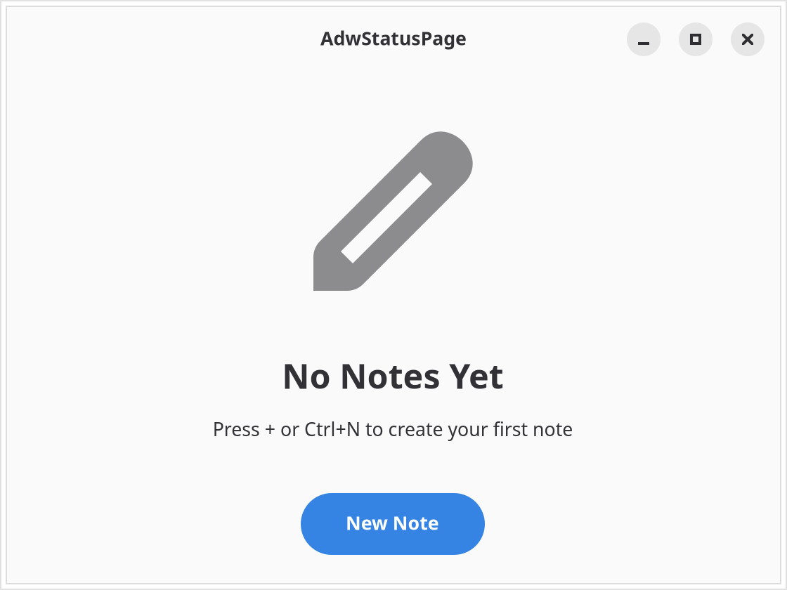{.light-only}
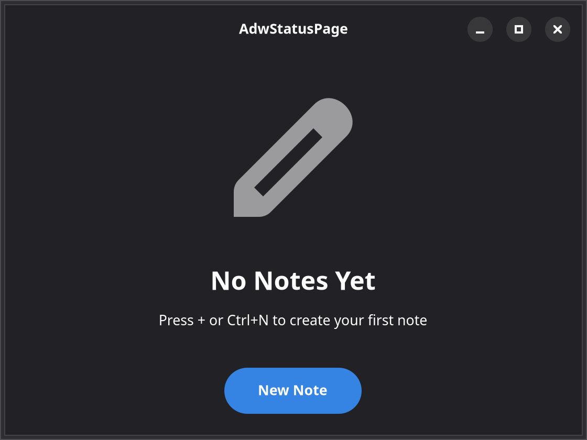{.dark-only}

::: details Source
<<< @/screenshots/gallery/fixtures/status-page.tsx
:::

[Libadwaita docs](https://gnome.pages.gitlab.gnome.org/libadwaita/doc/1-latest/class.StatusPage.html)

### AdwBanner

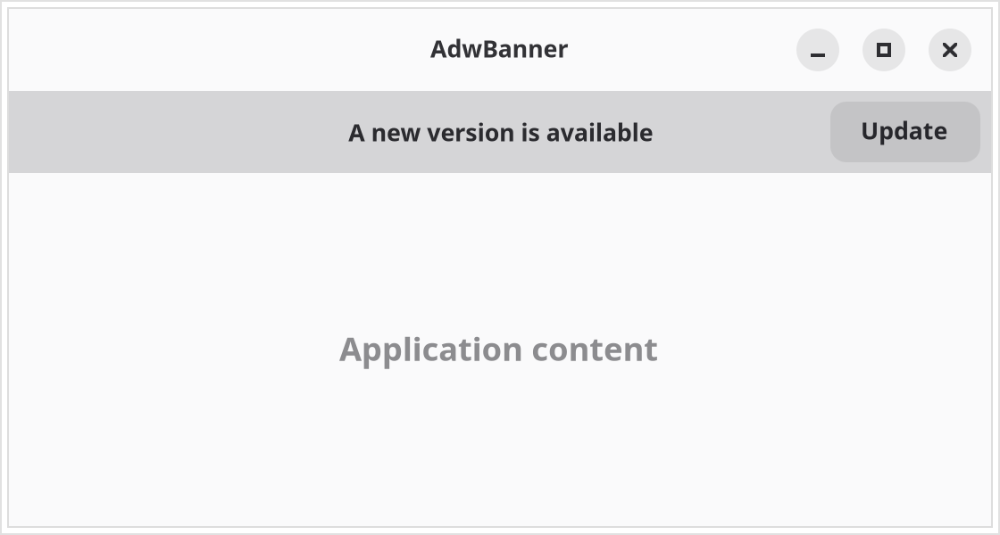{.light-only}
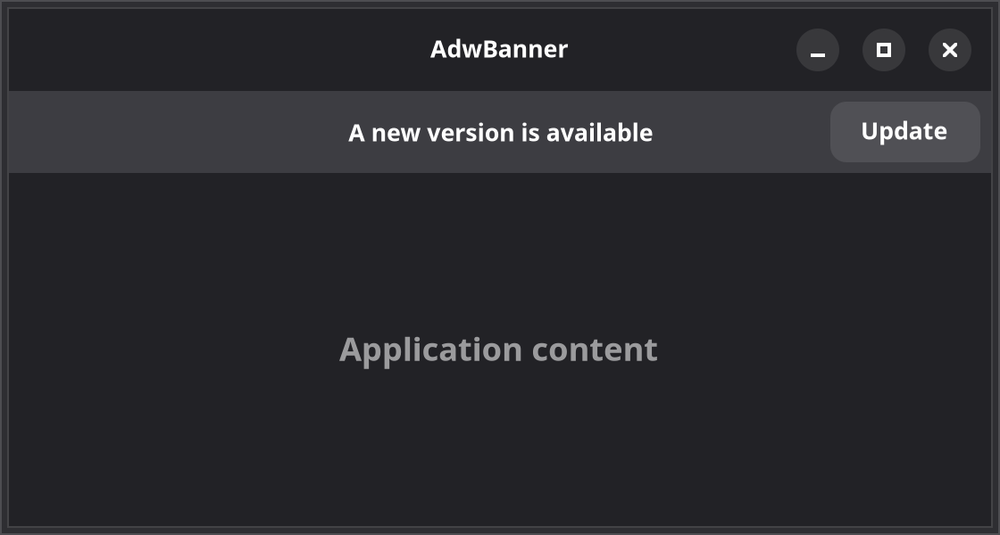{.dark-only}

::: details Source
<<< @/screenshots/gallery/fixtures/banner.tsx
:::

[Libadwaita docs](https://gnome.pages.gitlab.gnome.org/libadwaita/doc/1-latest/class.Banner.html)

### Preference rows

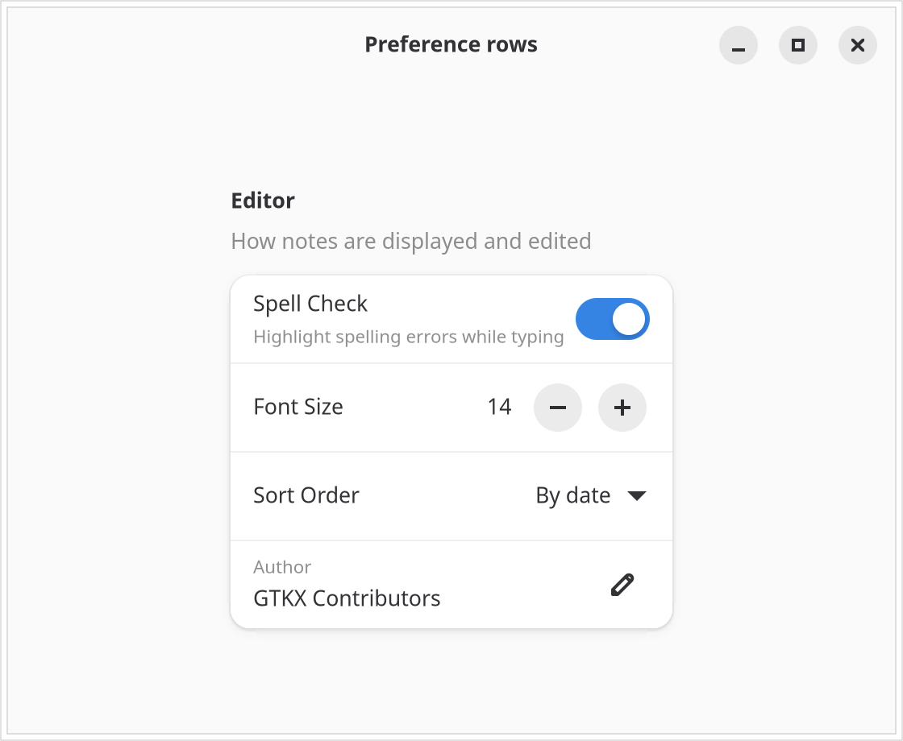{.light-only}
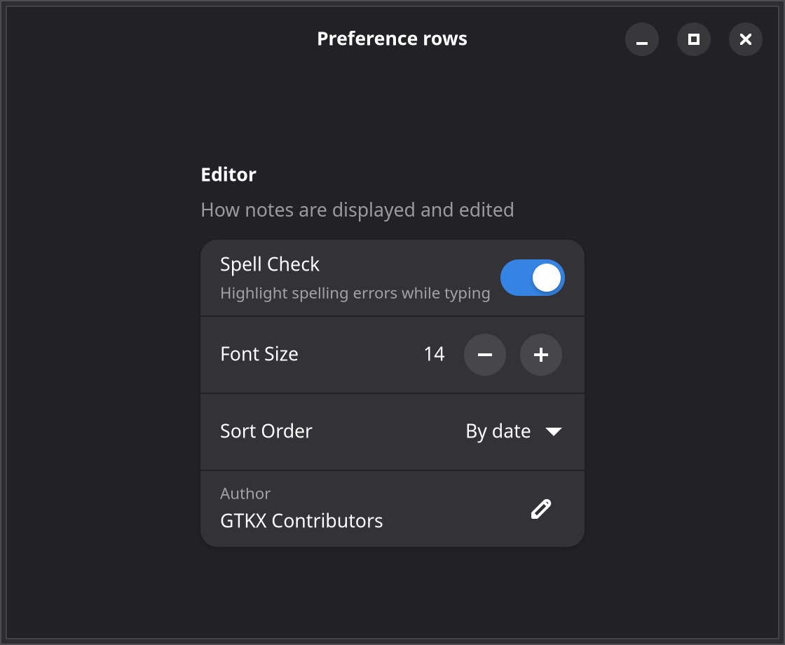{.dark-only}

::: details Source
<<< @/screenshots/gallery/fixtures/preference-rows.tsx
:::

[Libadwaita docs](https://gnome.pages.gitlab.gnome.org/libadwaita/doc/1-latest/class.PreferencesGroup.html)

### AdwToastOverlay

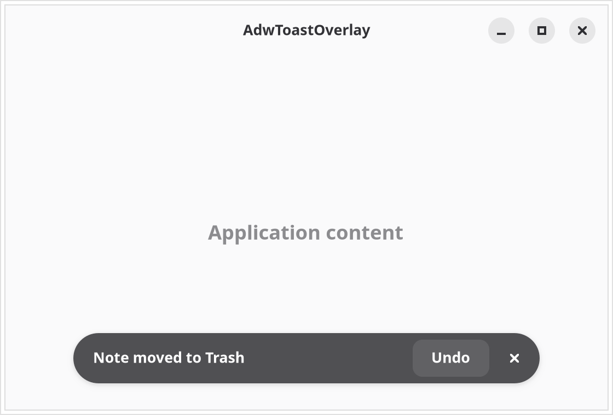{.light-only}
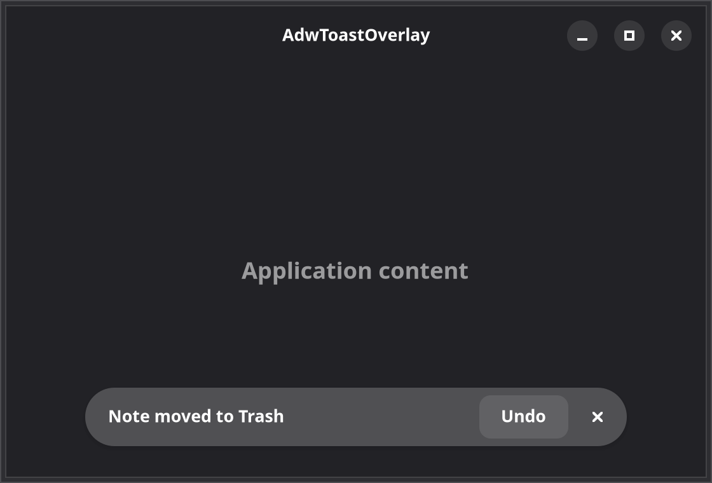{.dark-only}

::: details Source
<<< @/screenshots/gallery/fixtures/toast-overlay.tsx
:::

[Libadwaita docs](https://gnome.pages.gitlab.gnome.org/libadwaita/doc/1-latest/class.ToastOverlay.html)

### AdwToggleGroup

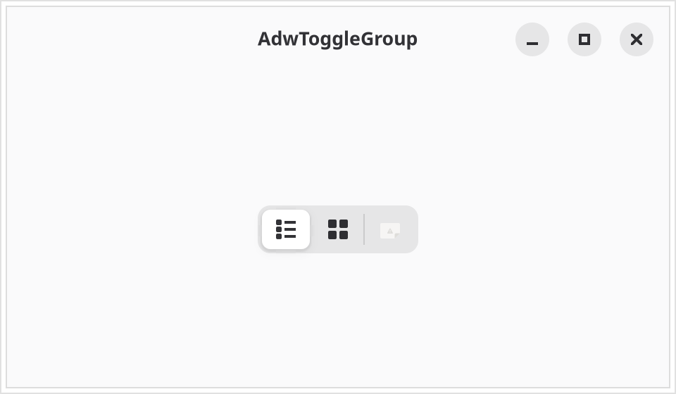{.light-only}
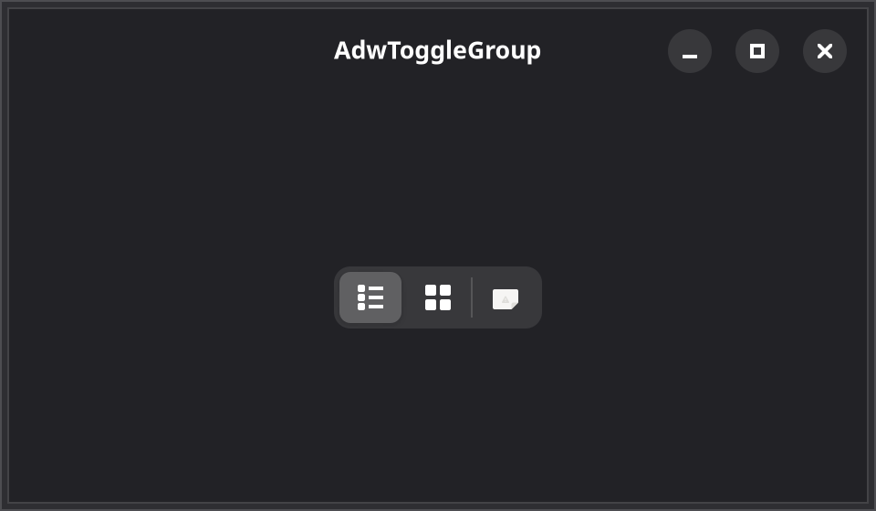{.dark-only}

::: details Source
<<< @/screenshots/gallery/fixtures/toggle-group.tsx
:::

[Libadwaita docs](https://gnome.pages.gitlab.gnome.org/libadwaita/doc/1-latest/class.ToggleGroup.html)

### AdwAvatar

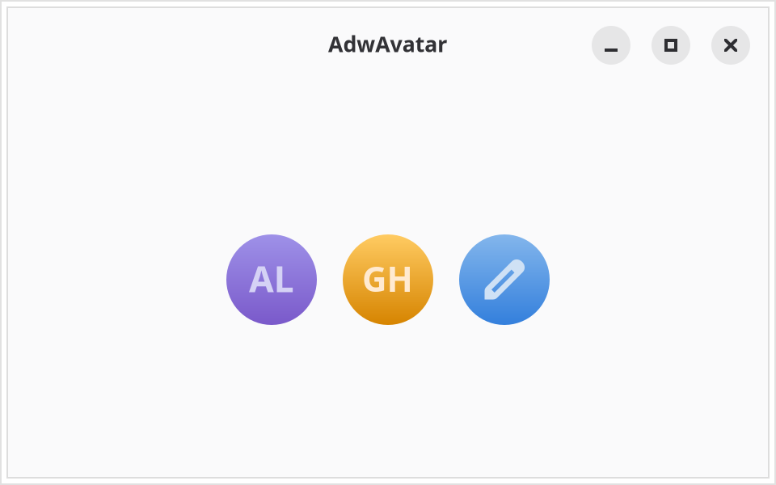{.light-only}
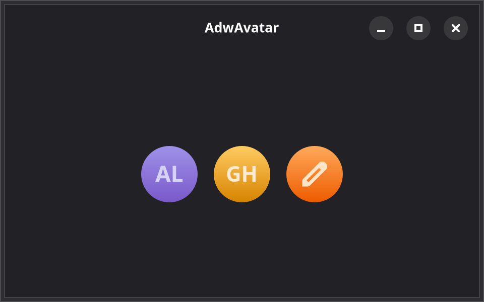{.dark-only}

::: details Source
<<< @/screenshots/gallery/fixtures/avatar.tsx
:::

[Libadwaita docs](https://gnome.pages.gitlab.gnome.org/libadwaita/doc/1-latest/class.Avatar.html)
