<!-- Generated by scripts/gallery.ts from screenshots/gallery/manifest.ts. Do not edit by hand. -->

# Layout & containers

The building blocks that arrange other widgets: boxes, grids, panes, frames, and overlays. Every screenshot below is captured from a real GTKX render of the source shown with it.

### GtkBox

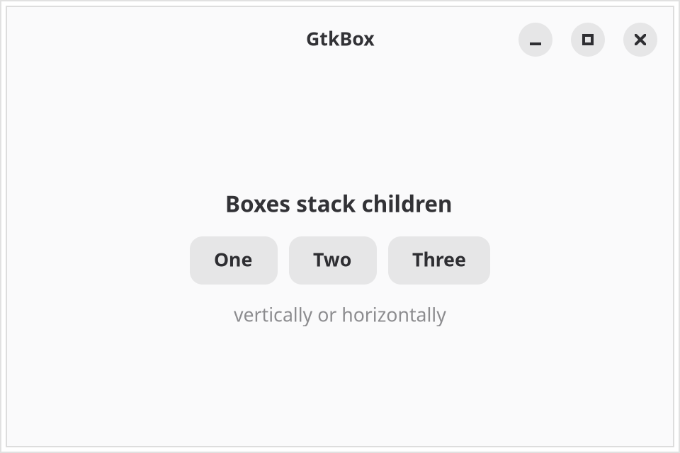{.light-only}
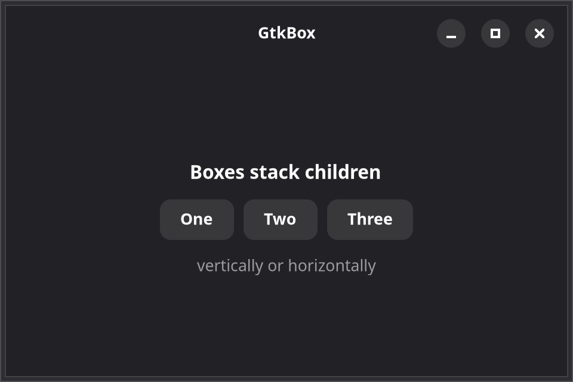{.dark-only}

::: details Source
<<< @/screenshots/gallery/fixtures/box.tsx
:::

[GTK docs](https://docs.gtk.org/gtk4/class.Box.html)

### GtkGrid

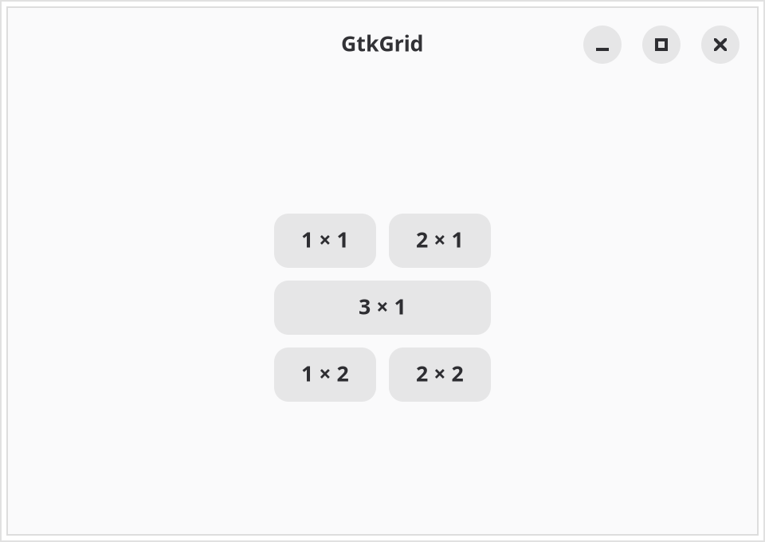{.light-only}
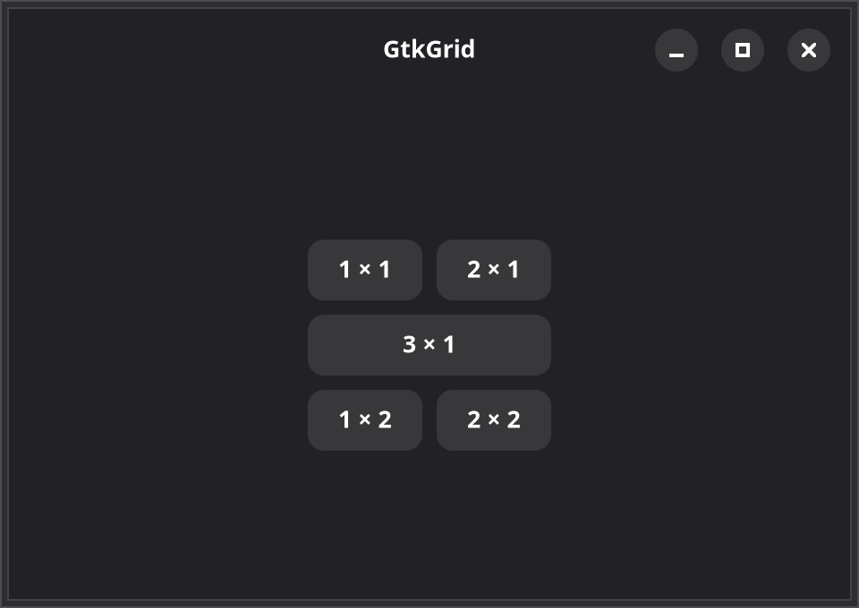{.dark-only}

::: details Source
<<< @/screenshots/gallery/fixtures/grid.tsx
:::

[GTK docs](https://docs.gtk.org/gtk4/class.Grid.html)

### GtkCenterBox

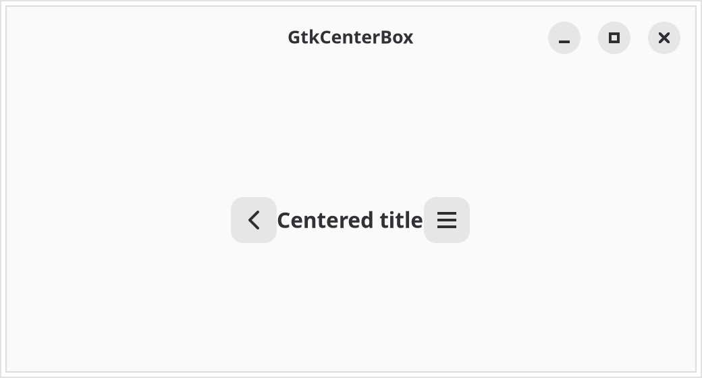{.light-only}
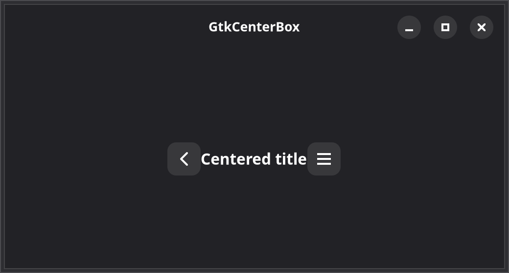{.dark-only}

::: details Source
<<< @/screenshots/gallery/fixtures/center-box.tsx
:::

[GTK docs](https://docs.gtk.org/gtk4/class.CenterBox.html)

### GtkPaned

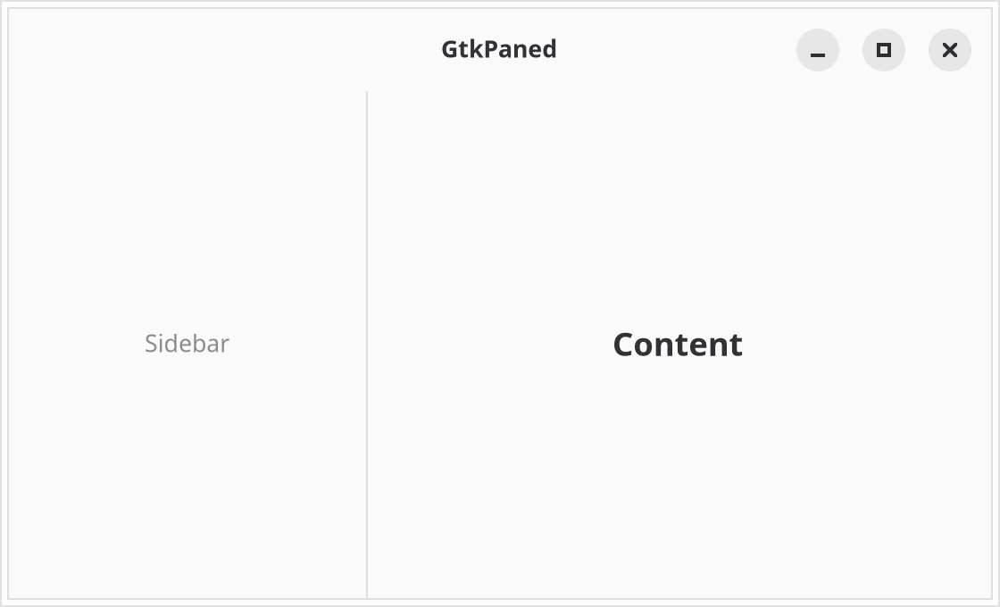{.light-only}
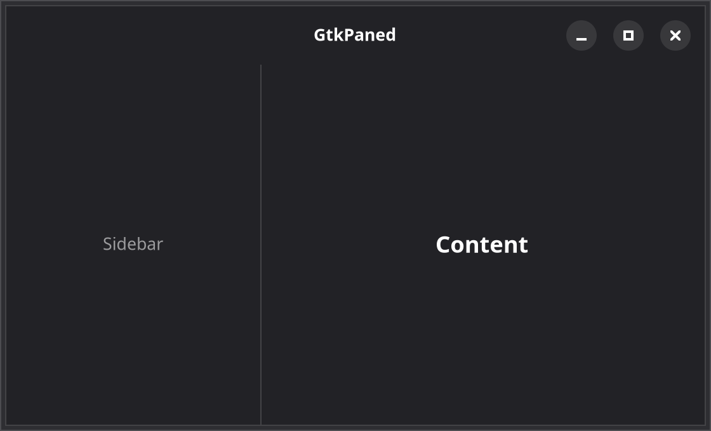{.dark-only}

::: details Source
<<< @/screenshots/gallery/fixtures/paned.tsx
:::

[GTK docs](https://docs.gtk.org/gtk4/class.Paned.html)

### GtkFrame

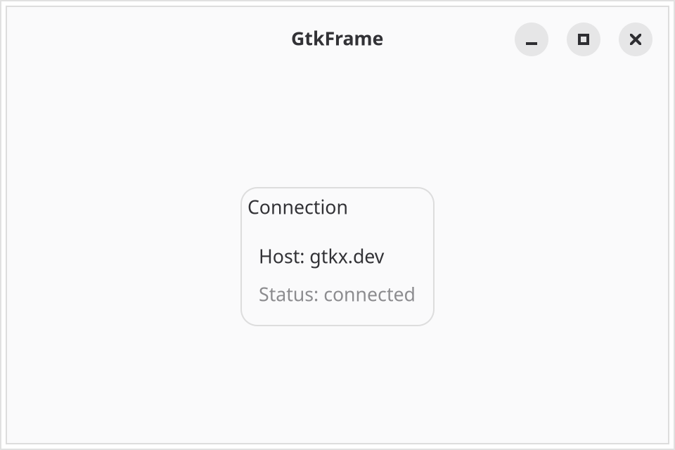{.light-only}
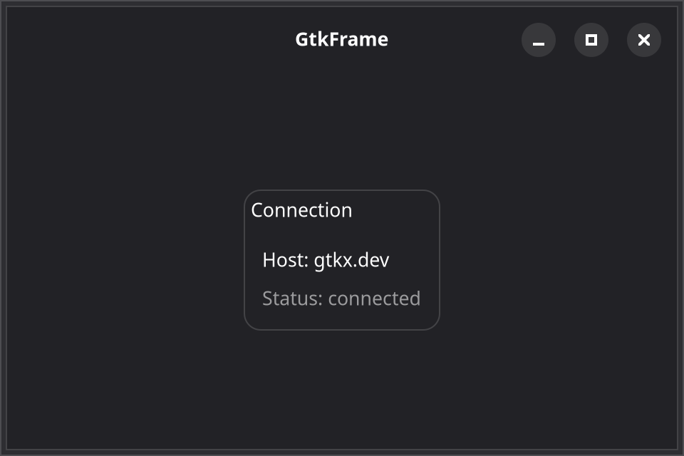{.dark-only}

::: details Source
<<< @/screenshots/gallery/fixtures/frame.tsx
:::

[GTK docs](https://docs.gtk.org/gtk4/class.Frame.html)

### GtkOverlay

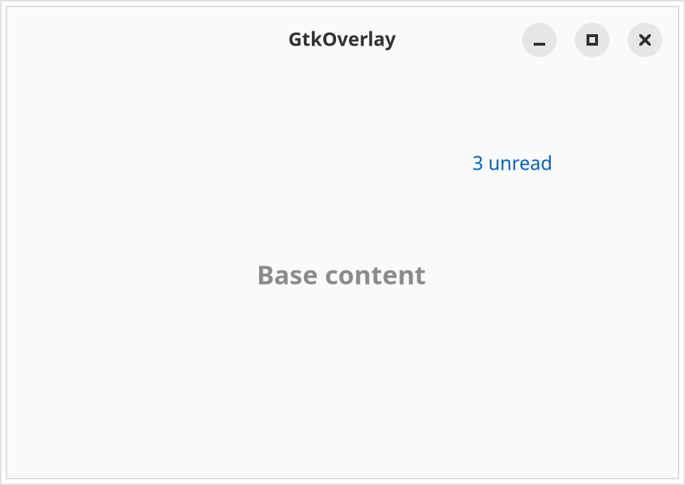{.light-only}
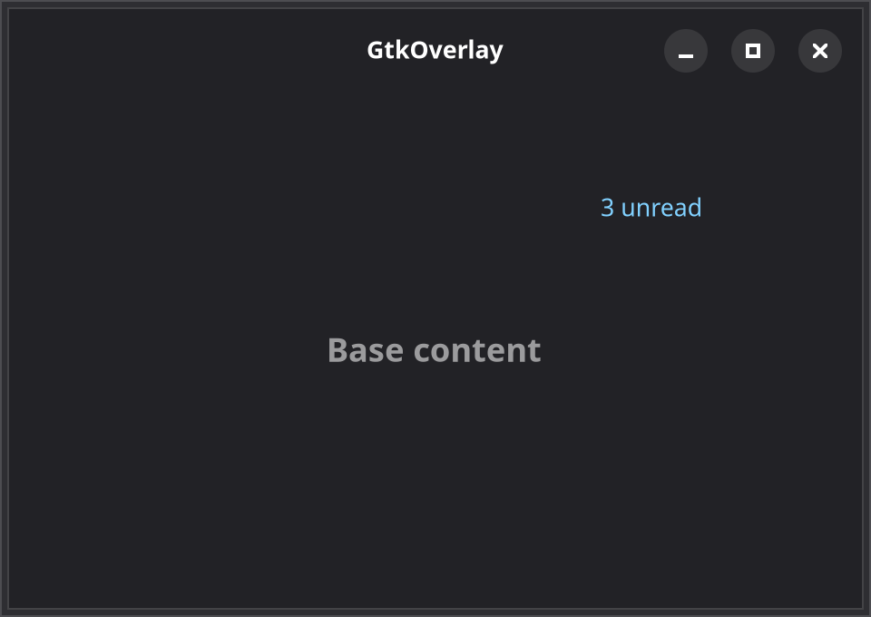{.dark-only}

::: details Source
<<< @/screenshots/gallery/fixtures/overlay.tsx
:::

[GTK docs](https://docs.gtk.org/gtk4/class.Overlay.html)

### GtkFlowBox

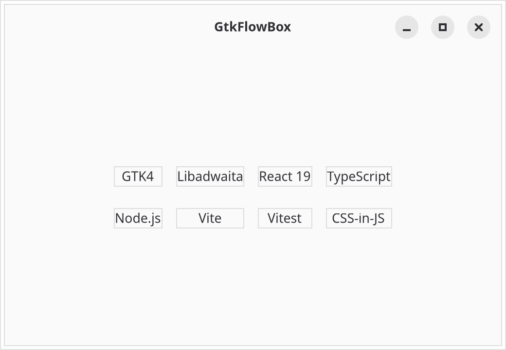{.light-only}
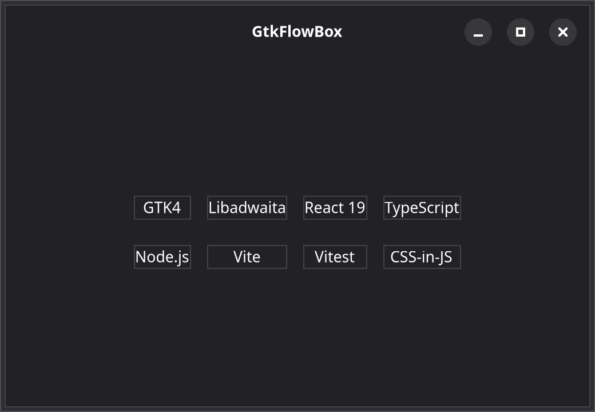{.dark-only}

::: details Source
<<< @/screenshots/gallery/fixtures/flow-box.tsx
:::

[GTK docs](https://docs.gtk.org/gtk4/class.FlowBox.html)

### GtkExpander

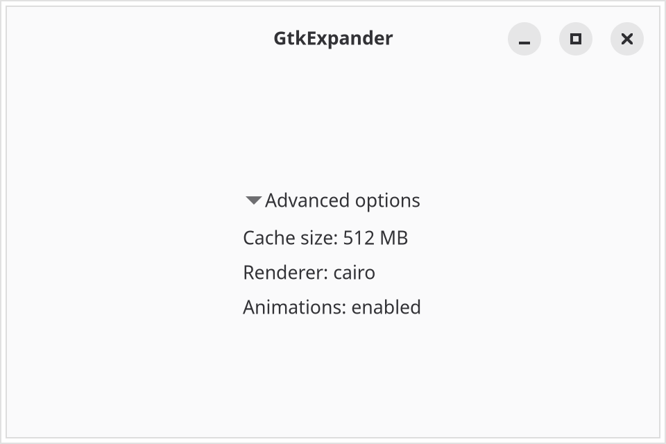{.light-only}
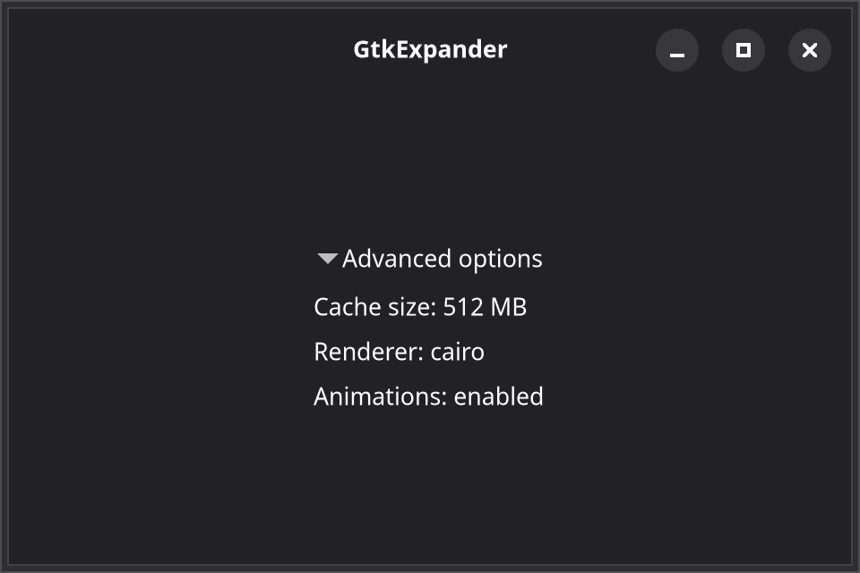{.dark-only}

::: details Source
<<< @/screenshots/gallery/fixtures/expander.tsx
:::

[GTK docs](https://docs.gtk.org/gtk4/class.Expander.html)
