<!-- Generated by scripts/gallery.ts from screenshots/gallery/manifest.ts. Do not edit by hand. -->

# Lists, tables & navigation

Virtualized lists and tables driven by the items contract, plus stacks and tabs for moving between views. Every screenshot below is captured from a real GTKX render of the source shown with it.

### GtkListView

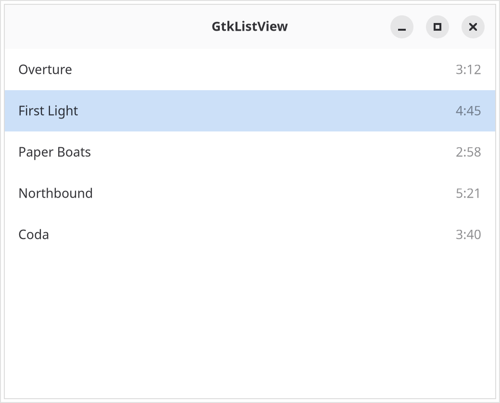{.light-only}
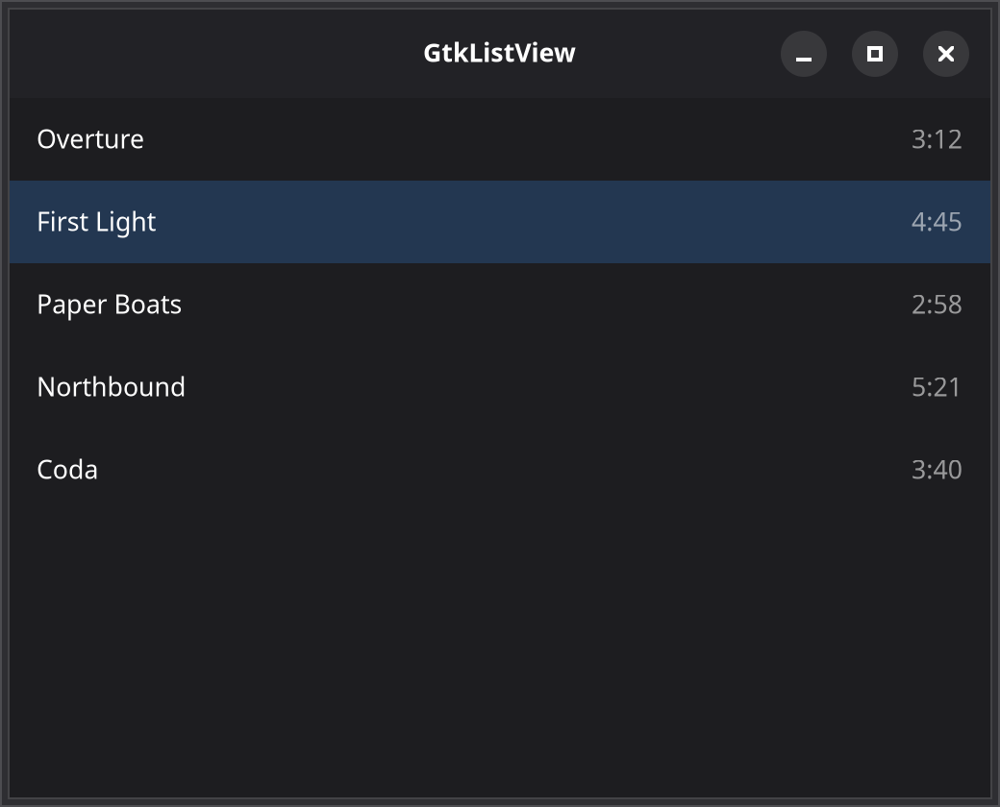{.dark-only}

::: details Source
<<< @/screenshots/gallery/fixtures/list-view.tsx
:::

[GTK docs](https://docs.gtk.org/gtk4/class.ListView.html) · [GTKX guide](/docs/guides/lists)

### GtkGridView

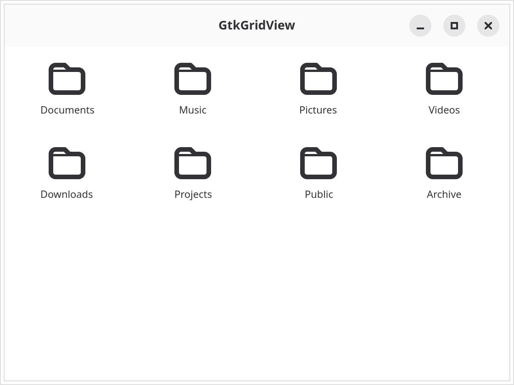{.light-only}
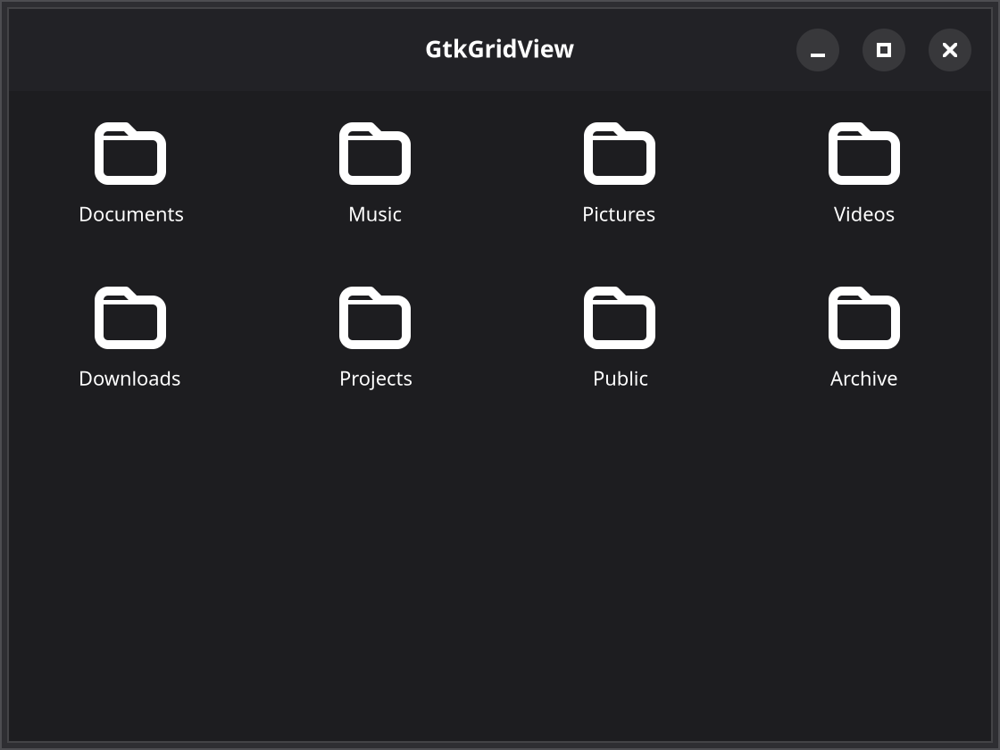{.dark-only}

::: details Source
<<< @/screenshots/gallery/fixtures/grid-view.tsx
:::

[GTK docs](https://docs.gtk.org/gtk4/class.GridView.html) · [GTKX guide](/docs/guides/lists)

### GtkColumnView

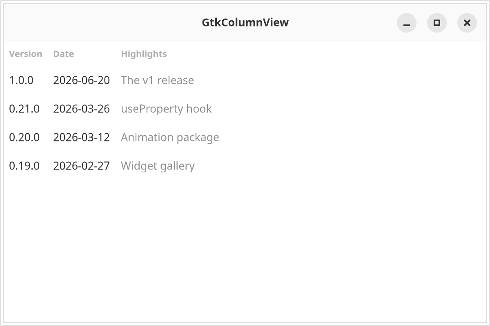{.light-only}
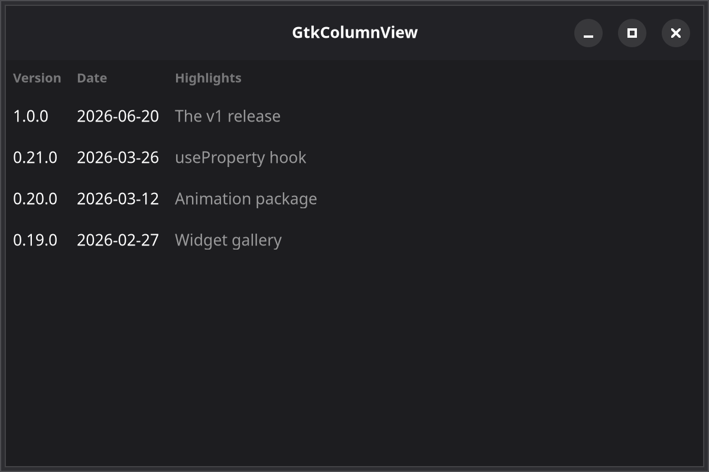{.dark-only}

::: details Source
<<< @/screenshots/gallery/fixtures/column-view.tsx
:::

[GTK docs](https://docs.gtk.org/gtk4/class.ColumnView.html) · [GTKX guide](/docs/guides/lists)

### GtkListBox

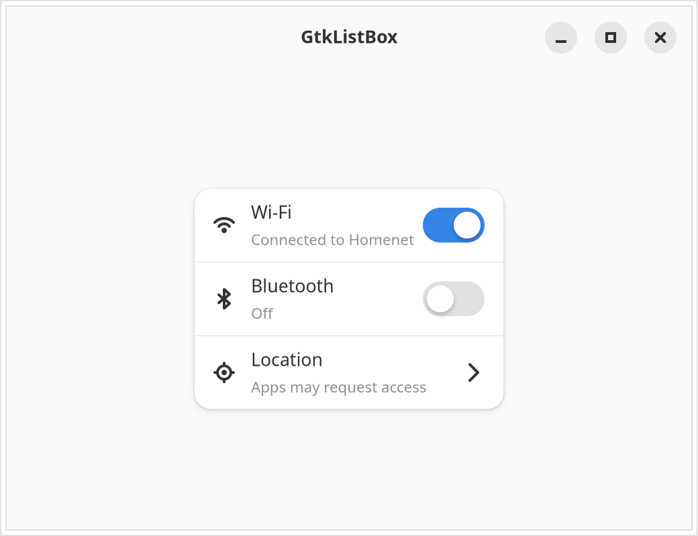{.light-only}
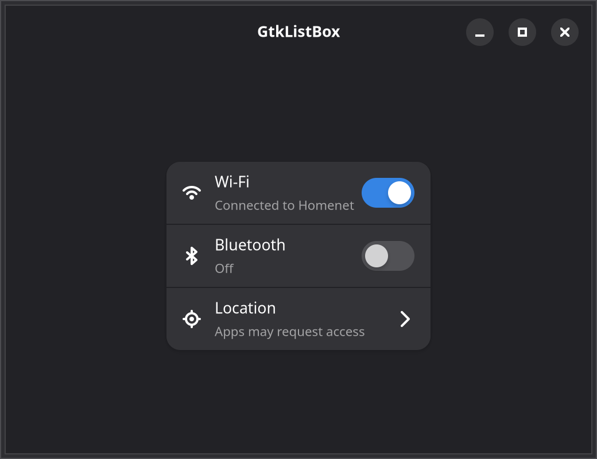{.dark-only}

::: details Source
<<< @/screenshots/gallery/fixtures/list-box.tsx
:::

[GTK docs](https://docs.gtk.org/gtk4/class.ListBox.html)

### GtkStack

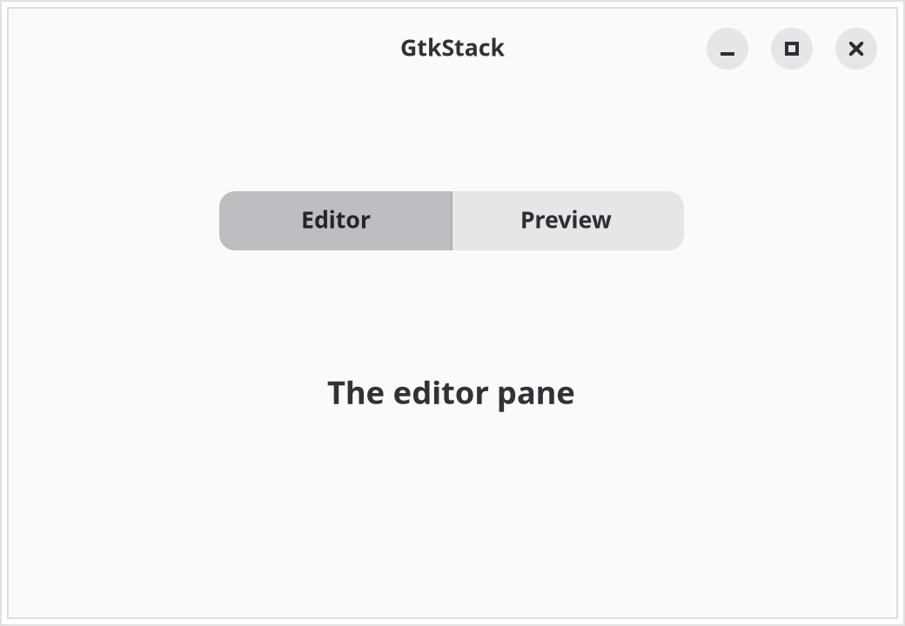{.light-only}
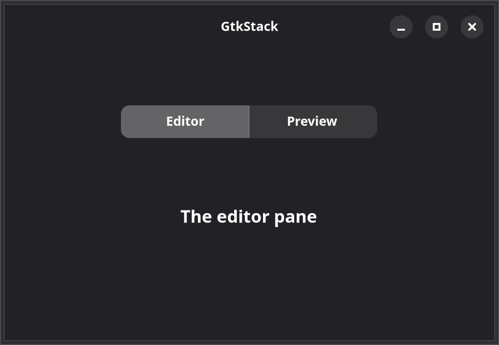{.dark-only}

::: details Source
<<< @/screenshots/gallery/fixtures/stack.tsx
:::

[GTK docs](https://docs.gtk.org/gtk4/class.Stack.html)

### GtkNotebook

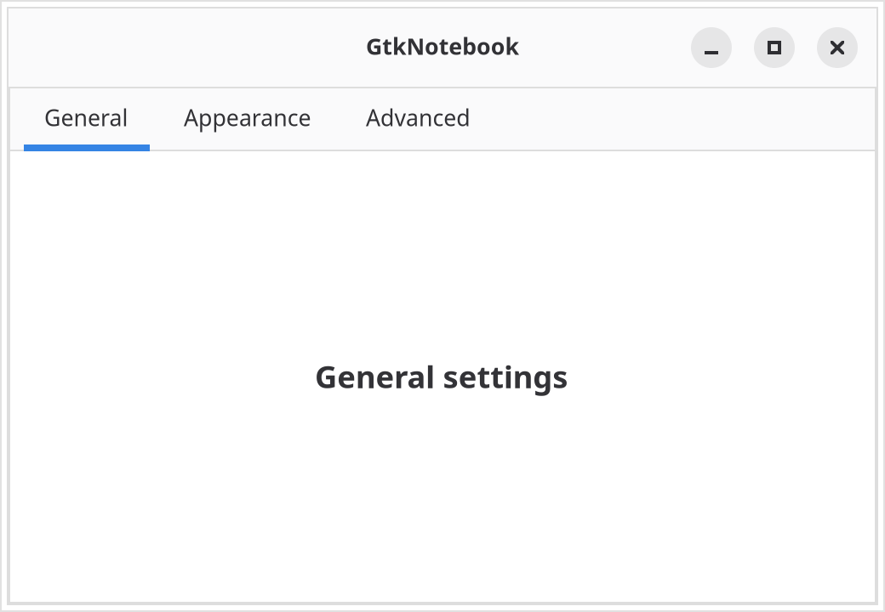{.light-only}
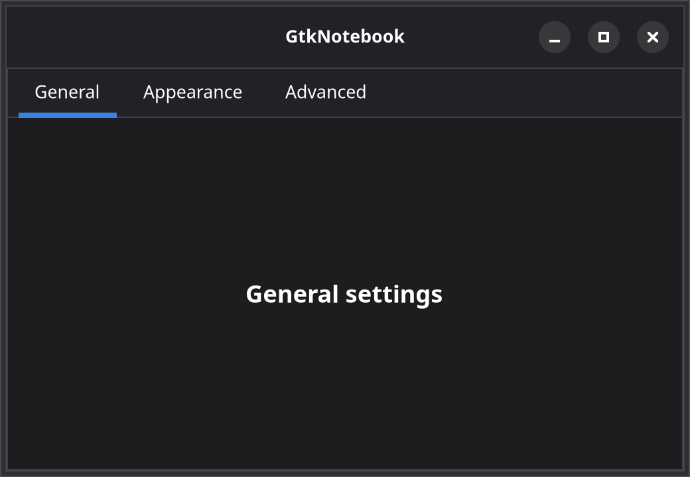{.dark-only}

::: details Source
<<< @/screenshots/gallery/fixtures/notebook.tsx
:::

[GTK docs](https://docs.gtk.org/gtk4/class.Notebook.html)
