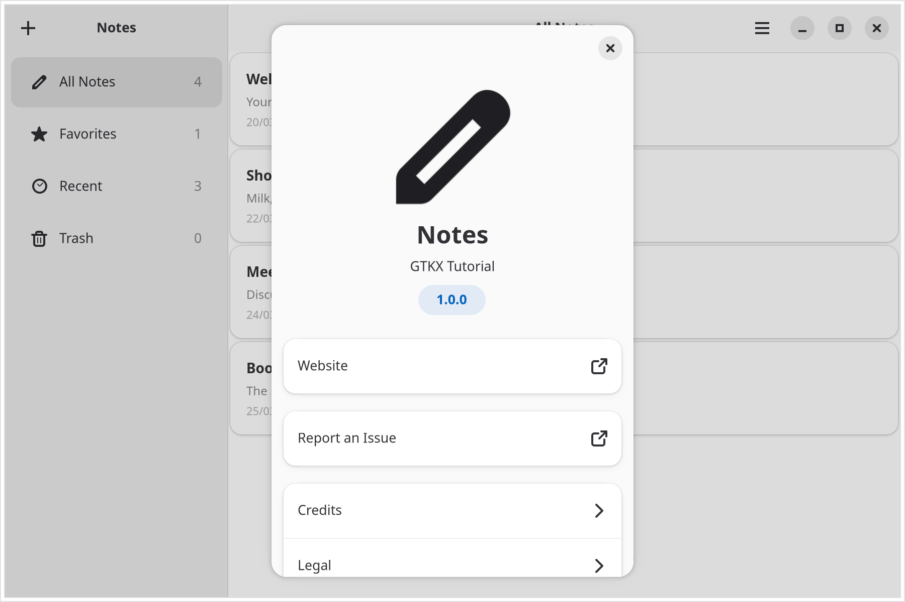
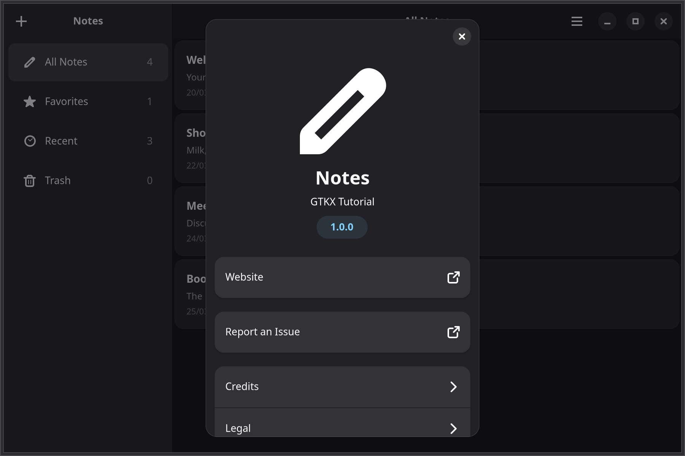
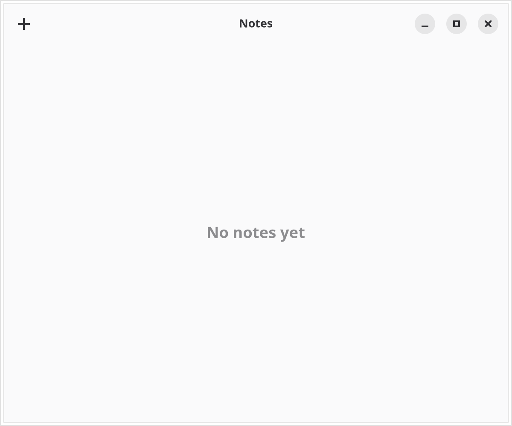
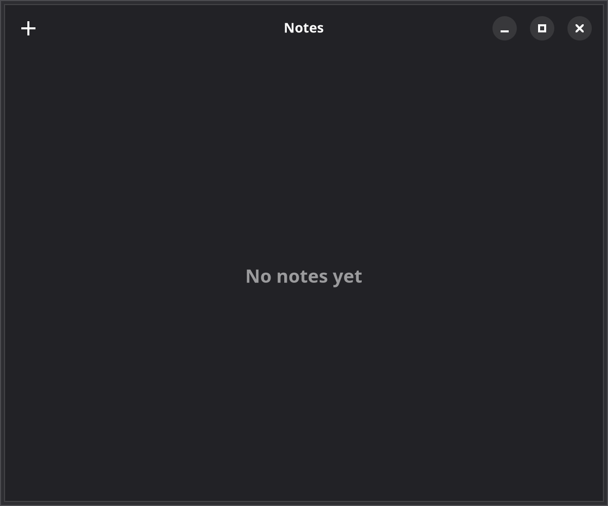

# 1. Window & header bar

In this tutorial, you'll build a fully-featured Notes application from scratch. Each chapter introduces new GTKX concepts by adding functionality to the app. By the end, you'll have a polished, deployable desktop application.

## What you'll build

{.light-only}
{.dark-only}

- A split-view notes list with sidebar categories, search, and list/grid view modes
- A main menu, window actions, and keyboard shortcuts
- Confirmation dialogs, undo toasts, and animated note cards
- A preferences dialog backed by GSettings

Chapter by chapter, you'll add [styling](./2-styling.md), [virtualized lists](./3-lists.md), [menus & shortcuts](./4-menus-and-shortcuts.md), [navigation](./5-navigation.md), [dialogs & animations](./6-dialogs-and-animations.md), and [settings & preferences](./7-settings-and-preferences.md), then [deploy](./8-deploying.md) the result. Plan for roughly two hours if you follow along.

## Create the project

Start by scaffolding a new project:

```bash
npx @gtkx/cli@latest create notes-app
```

When prompted, enter `com.example.notes` as the application ID, choose your preferred package manager, and enable testing. The application ID is written to `gtkx.config.ts`, and your code reads it from there through `@gtkx/config/runtime`.

## The entry point

A GTKX app starts in `src/index.tsx`, which renders the root component. `render` takes a single argument — the element tree:

```tsx
// src/index.tsx
import { render } from "@gtkx/react";
import { App } from "./app.js";

render(<App />);
```

The `<App />` tree owns the GTK application. The `<AdwApplication>` component creates, registers, and activates the application for you, then publishes it through context so hooks like `useApplication` can read it. You never construct an `Adw.Application` or `Gtk.Application` yourself, and you never pass one to `render`.

## The application window

Replace the generated `src/app.tsx` with an Adwaita-styled window wrapped in `<AdwApplication>`:

```tsx
// src/app.tsx
import { applicationId } from "@gtkx/config/runtime";
import {
    AdwApplication,
    AdwApplicationWindow,
    AdwHeaderBar,
    AdwStatusPage,
    AdwToolbarView,
} from "@gtkx/jsx/adw";
import { quit } from "@gtkx/react";

function NotesWindow() {
    return (
        <AdwApplicationWindow
            title="Notes"
            defaultWidth={600}
            defaultHeight={500}
            onCloseRequest={() => {
                quit();
                return true;
            }}
        >
            <AdwToolbarView addTopBar={<AdwHeaderBar />}>
                <AdwStatusPage
                    vexpand
                    iconName="document-edit-symbolic"
                    title="No Notes Yet"
                    description="Press + to create your first note"
                />
            </AdwToolbarView>
        </AdwApplicationWindow>
    );
}

export function App() {
    return (
        <AdwApplication applicationId={applicationId}>
            <NotesWindow />
        </AdwApplication>
    );
}
```

The window lives inside `<AdwApplication>`, whose `applicationId` comes from `@gtkx/config/runtime` — the resolved fields of `gtkx.config.ts`, including the ID you entered during scaffolding. Every later chapter keeps this structure: the inner `NotesWindow` component grows, while the `<AdwApplication>` wrapper stays exactly as shown here.

The `onCloseRequest` handler runs when the user clicks the window's close button. Returning `true` vetoes GTK's native close so your React code controls what happens — here it calls `quit()` to shut the application down. The same pattern drives secondary windows from state: set the state to `false` and return `true`, and React unmounts the window.

### Status pages

`AdwStatusPage` is the standard GNOME pattern for empty states and placeholder views. It displays a centered icon, title, and description — use it instead of manual label layouts.

### Slot props

Notice the `addTopBar` prop on `<AdwToolbarView>` — this is a **slot prop**. Instead of imperatively calling `toolbar.addTopBar(headerBar)`, you pass the widget through a JSX prop that accepts a React element. Slot props are auto-generated from GIR metadata and follow the pattern `parentMethodName={<Widget />}`.

For example, the header bar in `src/app.tsx` accepts a `titleWidget` slot that replaces the default title text with any widget (import `GtkLabel` from `@gtkx/jsx/gtk`):

```tsx
<AdwHeaderBar titleWidget={<GtkLabel label="Notes" cssClasses={["heading"]} />} />
```

The default window title works fine for now, so leave the header bar as is.

Common slot props you'll see throughout this tutorial:

| Prop | Purpose |
|-----------|---------|
| `AdwToolbarView` `addTopBar` | Add a widget to the top bar area |
| `AdwToolbarView` `addBottomBar` | Add a widget to the bottom bar area |
| `AdwHeaderBar` `packStart` | Pack a widget at the start of a header bar |
| `AdwHeaderBar` `packEnd` | Pack a widget at the end of a header bar |

Other common slot props include `popover`, `startChild`, `endChild`, and `content`.

## Adding header bar buttons

Add a "New Note" button to the header bar in `src/app.tsx`, packed at the start with the `packStart` slot prop:

```tsx
// src/app.tsx
import { applicationId } from "@gtkx/config/runtime";
import {
    AdwApplication,
    AdwApplicationWindow,
    AdwHeaderBar,
    AdwStatusPage,
    AdwToolbarView,
} from "@gtkx/jsx/adw";
import { GtkButton } from "@gtkx/jsx/gtk";
import { quit } from "@gtkx/react";

function NotesWindow() {
    return (
        <AdwApplicationWindow
            title="Notes"
            defaultWidth={600}
            defaultHeight={500}
            onCloseRequest={() => {
                quit();
                return true;
            }}
        >
            <AdwToolbarView
                addTopBar={
                    <AdwHeaderBar
                        packStart={
                            <GtkButton
                                iconName="list-add-symbolic"
                                tooltipText="New Note"
                                onClicked={() => console.log("New note!")}
                            />
                        }
                    />
                }
            >
                <AdwStatusPage
                    vexpand
                    iconName="document-edit-symbolic"
                    title="No Notes Yet"
                    description="Press + to create your first note"
                />
            </AdwToolbarView>
        </AdwApplicationWindow>
    );
}

export function App() {
    return (
        <AdwApplication applicationId={applicationId}>
            <NotesWindow />
        </AdwApplication>
    );
}
```

::: tip Tooltips
The GNOME HIG requires tooltips on all header bar controls. Always set `tooltipText` on buttons in the header bar so users can discover their function on hover.
:::

Run `npm run dev` to see your app with a header bar and a "+" button:

{.light-only}
{.dark-only}

## Next

In the [next chapter](./2-styling.md), you'll style the notes list with CSS-in-JS.

## Checkpoint

- You should now have a scaffolded Notes project whose entry point, `src/index.tsx`, renders `<App />` with a single `render` call.
- You should see an Adwaita window titled "Notes" with a header bar, a "+" button, and a status-page empty state when you run `npm run dev`.
- You should be able to place widgets with slot props such as `addTopBar`, `packStart`, and `titleWidget`.

The complete app this tutorial builds lives at [examples/tutorial](https://github.com/gtkx-org/gtkx/tree/main/examples/tutorial).
