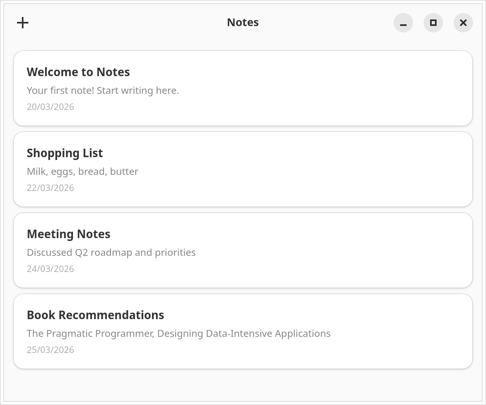
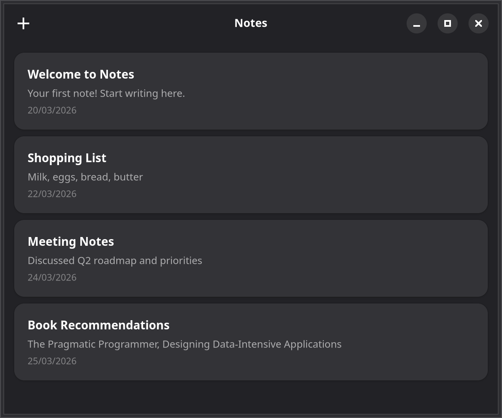

# 2. Styling with CSS-in-JS

Now that you have a window with a header bar, you'll add some notes and style them as cards with `@gtkx/css`.

{.light-only}
{.dark-only}

The `NotesWindow` component below lives inside the `<AdwApplication>` wrapper introduced in [Chapter 1](./1-window-and-header-bar.md). The wrapper and `src/index.tsx` stay unchanged; only `NotesWindow` in `src/app.tsx` grows.

## Adding note state

Declare the `Note` shape at module level in `src/app.tsx`:

```tsx
interface Note {
    id: string;
    title: string;
    body: string;
    createdAt: Date;
}
```

Inside `NotesWindow`, hold the notes in state and add a creation handler:

```tsx
const [notes, setNotes] = useState<Note[]>([
    { id: "1", title: "Welcome", body: "Your first note!", createdAt: new Date() },
    { id: "2", title: "Shopping List", body: "Milk, eggs, bread", createdAt: new Date() },
    { id: "3", title: "Meeting Notes", body: "Discuss project timeline and deliverables", createdAt: new Date() },
]);

const addNote = () => {
    const note: Note = {
        id: crypto.randomUUID(),
        title: "Untitled",
        body: "",
        createdAt: new Date(),
    };
    setNotes((prev) => [note, ...prev]);
};
```

## Styling with `@gtkx/css`

The `css` function from `@gtkx/css` generates a unique class name that you pass to `cssClasses`. Define the styles at module level in `src/app.tsx`:

```tsx
import { css } from "@gtkx/css";

const noteCard = css`
    background: @card_bg_color;
    border-radius: 12px;
    padding: 16px;
    box-shadow:
        0 1px 4px alpha(black, 0.15),
        0 0 0 1px alpha(black, 0.08);

    &:hover {
        box-shadow:
            0 2px 8px alpha(black, 0.2),
            0 0 0 1px alpha(black, 0.1);
    }
`;

const noteTitle = css`
    font-weight: bold;
    font-size: 14px;
`;

const notePreview = css`
    color: alpha(@window_fg_color, 0.6);
    font-size: 12px;
`;

const noteDate = css`
    color: alpha(@window_fg_color, 0.4);
    font-size: 11px;
`;
```

GTK CSS uses `@`-named colors like `@card_bg_color` and `@window_fg_color` that automatically adapt to the light and dark themes, and an `alpha()` function that adjusts a color's opacity. The card pairs a solid `@card_bg_color` background with a layered `box-shadow`, so cards read as elevated surfaces in both themes — hovering deepens the shadow.

::: tip Watch the terminal for rejected styles
GTKX logs a `[gtkx/css]` warning whenever GTK rejects a CSS rule, so check the terminal first if a style fails to apply.
:::

## Rendering the notes list

Put it all together — here is the complete `src/app.tsx` after this chapter:

```tsx
import { css } from "@gtkx/css";
import * as Gtk from "@gtkx/gi/gtk";
import {
    AdwApplication,
    AdwApplicationWindow,
    AdwHeaderBar,
    AdwStatusPage,
    AdwToolbarView,
} from "@gtkx/jsx/adw";
import { GtkBox, GtkButton, GtkLabel, GtkScrolledWindow } from "@gtkx/jsx/gtk";
import { quit } from "@gtkx/react";
import { useState } from "react";

const noteCard = css`
    background: @card_bg_color;
    border-radius: 12px;
    padding: 16px;
    box-shadow:
        0 1px 4px alpha(black, 0.15),
        0 0 0 1px alpha(black, 0.08);

    &:hover {
        box-shadow:
            0 2px 8px alpha(black, 0.2),
            0 0 0 1px alpha(black, 0.1);
    }
`;

const noteTitle = css`
    font-weight: bold;
    font-size: 14px;
`;

const notePreview = css`
    color: alpha(@window_fg_color, 0.6);
    font-size: 12px;
`;

const noteDate = css`
    color: alpha(@window_fg_color, 0.4);
    font-size: 11px;
`;

interface Note {
    id: string;
    title: string;
    body: string;
    createdAt: Date;
}

function NotesWindow() {
    const [notes, setNotes] = useState<Note[]>([
        { id: "1", title: "Welcome", body: "Your first note!", createdAt: new Date() },
        { id: "2", title: "Shopping List", body: "Milk, eggs, bread", createdAt: new Date() },
        { id: "3", title: "Meeting Notes", body: "Discuss project timeline and deliverables", createdAt: new Date() },
    ]);

    const addNote = () => {
        const note: Note = {
            id: crypto.randomUUID(),
            title: "Untitled",
            body: "",
            createdAt: new Date(),
        };
        setNotes((prev) => [note, ...prev]);
    };

    return (
        <AdwApplicationWindow
            title="Notes"
            defaultWidth={600}
            defaultHeight={500}
            onCloseRequest={() => {
                quit();
                return true;
            }}
        >
            <AdwToolbarView
                addTopBar={
                    <AdwHeaderBar
                        packStart={
                            <GtkButton iconName="list-add-symbolic" tooltipText="New Note" onClicked={addNote} />
                        }
                    />
                }
            >
                {notes.length > 0 ? (
                    <GtkScrolledWindow vexpand>
                        <GtkBox
                            orientation={Gtk.Orientation.VERTICAL}
                            spacing={8}
                            marginTop={12}
                            marginBottom={12}
                            marginStart={12}
                            marginEnd={12}
                        >
                            {notes.map((note) => (
                                <GtkBox
                                    key={note.id}
                                    orientation={Gtk.Orientation.VERTICAL}
                                    spacing={4}
                                    cssClasses={[noteCard]}
                                >
                                    <GtkLabel
                                        label={note.title}
                                        halign={Gtk.Align.START}
                                        cssClasses={[noteTitle]}
                                    />
                                    <GtkLabel
                                        label={note.body || "Empty note"}
                                        halign={Gtk.Align.START}
                                        cssClasses={[notePreview]}
                                        ellipsize={2}
                                        lines={1}
                                    />
                                    <GtkLabel
                                        label={note.createdAt.toLocaleDateString()}
                                        halign={Gtk.Align.START}
                                        cssClasses={[noteDate]}
                                    />
                                </GtkBox>
                            ))}
                        </GtkBox>
                    </GtkScrolledWindow>
                ) : (
                    <AdwStatusPage
                        vexpand
                        iconName="document-edit-symbolic"
                        title="No Notes Yet"
                        description="Press + to create your first note"
                    />
                )}
            </AdwToolbarView>
        </AdwApplicationWindow>
    );
}

export function App() {
    return (
        <AdwApplication applicationId="com.example.notes">
            <NotesWindow />
        </AdwApplication>
    );
}
```

## Dynamic styles

You can interpolate values into CSS strings, just like Emotion — identical styles reuse the same class name. In `src/app.tsx`, turn `noteTitle` into a function of the font size:

```tsx
const noteTitle = (fontSize: number) => css`
    font-weight: bold;
    font-size: ${fontSize}px;
`;
```

Pass the result the same way: `cssClasses={[noteTitle(14)]}`. In [Chapter 7](./7-settings-and-preferences.md), the app wires this value to a user preference so the card text resizes live.

## Global styles

For app-wide styles, use `injectGlobal` from any module your entry imports — or import a plain `.css` file and let the GTKX Vite plugin apply it for you:

```tsx
import { injectGlobal } from "@gtkx/css";

injectGlobal`
    window {
        background: @window_bg_color;
    }
`;
```

## Next

In the [next chapter](./3-lists.md), you'll replace the simple `map()` rendering with a virtualized `GtkListView` for efficient scrolling with large datasets.

## Checkpoint

You should now:

- have three seed notes held in React state and rendered as rounded cards in a scrollable column;
- see the cards drawn as elevated surfaces that adapt to the light and dark themes, with a deeper shadow on hover;
- be able to press the header bar's "+" button and watch a new note appear at the top of the list.

The complete app this tutorial builds lives at [examples/tutorial](https://github.com/gtkx-org/gtkx/tree/main/examples/tutorial).
