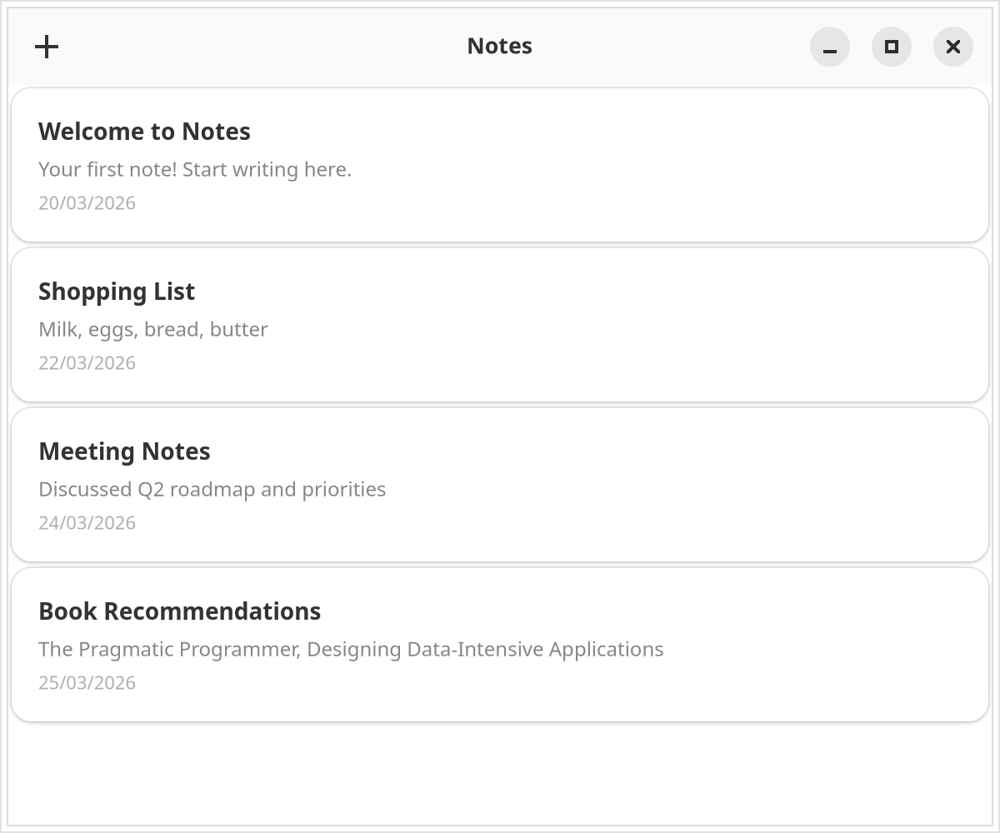
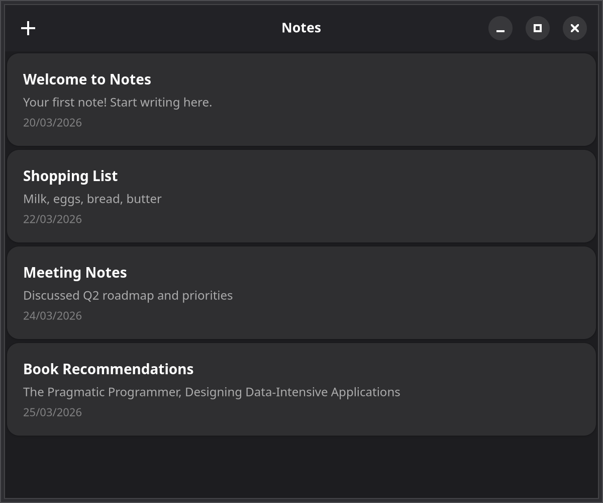

# 3. Lists & data

The `map()` approach from the previous chapter works for a handful of notes, but it builds one widget per note no matter how many are on screen. GTK provides virtualized list widgets that only realize visible rows, and GTKX wraps them with a declarative API.

{.light-only}
{.dark-only}

These snippets slot into the `NotesWindow` component in `src/app.tsx`, which still lives inside the `<AdwApplication>` wrapper from [Chapter 1](./1-window-and-header-bar.md). The `noteCard`, `noteTitle`, `notePreview`, and `noteDate` class names come from [Chapter 2](./2-styling.md).

## The items contract

Every GTKX list component — `GtkListView`, `GtkGridView`, `GtkColumnView` — shares one data contract. Instead of mapping notes to child elements, you hand the component an `items` array and a render callback:

```tsx
const items = notes.map((note) => ({ id: note.id, value: note }));
```

- **`id`** — a unique string that must stay stable across renders. GTKX uses it to track each item through insertions, removals, and reorders, and selection is reported as arrays of these ids. The notes already carry one: `addNote` from Chapter 2 assigns `crypto.randomUUID()` once, at creation time.
- **`value`** — your data, passed verbatim to the render callback.

::: warning Stable ids
Never derive `id` from the array index. When the list is filtered or reordered, an index points at a different note, so selection and item tracking silently follow the position instead of the note. Generate ids when the data is created and store them on it.
:::

## GtkListView

First, add selection state to `NotesWindow` in `src/app.tsx`:

```tsx
const [selectedId, setSelectedId] = useState<string | null>(null);
```

Then replace the `GtkScrolledWindow` block from Chapter 2 — the one wrapping the `notes.map()` loop — with a `GtkListView`. The `notes.length > 0` conditional around it, with the `AdwStatusPage` empty state, stays as it is:

```tsx
import * as Gtk from "@gtkx/gi/gtk";
import { GtkBox, GtkLabel, GtkListView, GtkScrolledWindow } from "@gtkx/jsx/gtk";

<GtkScrolledWindow vexpand>
    <GtkListView
        estimatedItemHeight={80}
        selectionMode={Gtk.SelectionMode.SINGLE}
        selected={selectedId ? [selectedId] : []}
        onSelectionChanged={(ids) => setSelectedId(ids[0] ?? null)}
        items={notes.map((note) => ({ id: note.id, value: note }))}
        renderItem={(note) => (
            <GtkBox orientation={Gtk.Orientation.VERTICAL} spacing={4} cssClasses={[noteCard]}>
                <GtkLabel label={note.title} halign={Gtk.Align.START} cssClasses={[noteTitle]} />
                <GtkLabel
                    label={note.body || "Empty note"}
                    halign={Gtk.Align.START}
                    cssClasses={[notePreview]}
                    ellipsize={2}
                    lines={1}
                />
                <GtkLabel
                    label={note.createdAt.toLocaleDateString()}
                    halign={Gtk.Align.START}
                    cssClasses={[noteDate]}
                />
            </GtkBox>
        )}
    />
</GtkScrolledWindow>
```

The row markup is the same as Chapter 2's — only the ownership changed. `renderItem` runs for rows entering the viewport, and GTK recycles row widgets as you scroll, so a list of ten thousand notes costs about as much as a list of twenty.

### Key props

- **`items`** — the `{ id, value }` array described above.
- **`renderItem`** — receives the item's `value` and returns the row's widget tree.
- **`estimatedItemHeight`** — approximate row height in pixels, used as a virtualization hint before real rows are measured.
- **`selectionMode`** — `Gtk.SelectionMode.NONE`, `SINGLE`, `BROWSE`, or `MULTIPLE`.
- **`selected`** / **`onSelectionChanged`** — controlled selection state as an array of item ids. With `SINGLE` mode the array holds at most one id, which is why the handler reads `ids[0]`.

The `selectedId` state does nothing visible yet beyond highlighting the row — [Chapter 5](./5-navigation.md) uses it to open the selected note in an editor. In the finished app, this list lives in a `NoteListContent` component inside `src/app.tsx`, extracted once a grid view joins it in [Chapter 6](./6-dialogs-and-animations.md).

## Side excursion: tables with GtkColumnView

Notes does not use a table, but here is the same data as one. `GtkColumnView` takes the identical `items` array and adds `GtkColumnViewColumn` children, each owning one column's header and cell rendering. If you want to try it, drop this component into `src/app.tsx` and render `<NotesTable notes={notes} />` in place of the list:

```tsx
import * as Gtk from "@gtkx/gi/gtk";
import { GtkColumnView, GtkColumnViewColumn, GtkLabel, GtkScrolledWindow } from "@gtkx/jsx/gtk";
import { useState } from "react";

const compareNotes = (a: Note, b: Note, column: string | null): number => {
    switch (column) {
        case "title":
            return a.title.localeCompare(b.title);
        case "createdAt":
            return a.createdAt.getTime() - b.createdAt.getTime();
        default:
            return 0;
    }
};

const NotesTable = ({ notes }: { notes: Note[] }) => {
    const [sortColumn, setSortColumn] = useState<string | null>("title");
    const [sortOrder, setSortOrder] = useState<Gtk.SortType>(Gtk.SortType.ASCENDING);

    const sorted = [...notes].sort((a, b) => {
        const comparison = compareNotes(a, b, sortColumn);
        return sortOrder === Gtk.SortType.ASCENDING ? comparison : -comparison;
    });

    return (
        <GtkScrolledWindow vexpand hexpand>
            <GtkColumnView
                estimatedRowHeight={48}
                sortColumn={sortColumn}
                sortOrder={sortOrder}
                onSortChanged={(column, order) => {
                    setSortColumn(column);
                    setSortOrder(order);
                }}
                items={sorted.map((note) => ({ id: note.id, value: note }))}
            >
                <GtkColumnViewColumn
                    id="title"
                    title="Title"
                    expand
                    resizable
                    sortable
                    renderCell={(note: Note) => <GtkLabel label={note.title} halign={Gtk.Align.START} />}
                />
                <GtkColumnViewColumn
                    id="createdAt"
                    title="Created"
                    resizable
                    sortable
                    renderCell={(note: Note) => <GtkLabel label={note.createdAt.toLocaleDateString()} />}
                />
            </GtkColumnView>
        </GtkScrolledWindow>
    );
};
```

Sorting is controlled, like selection: the view never reorders your data. Clicking a sortable header fires `onSortChanged` with the column `id` and a `Gtk.SortType`; you sort the array yourself and render it back, while `sortColumn` and `sortOrder` keep the header arrows in sync.

For the full list API — section headers, column header menus, and driving a view from your own `Gio.ListModel` — see the in-depth [lists guide](/docs/guides/lists).

## Side excursion: tree lists

Notes keeps its list flat, but the same `GtkListView` renders hierarchies — no separate tree widget needed. If you later group notes into folders, nest `children` arrays inside the items:

```tsx
import * as Gtk from "@gtkx/gi/gtk";
import { GtkBox, GtkImage, GtkLabel, GtkListView } from "@gtkx/jsx/gtk";

const notesWithFolders = [
    {
        id: "personal",
        value: { title: "Personal", type: "folder" as const },
        children: [
            { id: "1", value: { title: "Journal", type: "note" as const } },
            { id: "2", value: { title: "Goals", type: "note" as const } },
        ],
    },
    {
        id: "work",
        value: { title: "Work", type: "folder" as const },
        children: [{ id: "3", value: { title: "Meeting Notes", type: "note" as const } }],
    },
];

<GtkListView
    estimatedItemHeight={40}
    autoexpand
    items={notesWithFolders}
    renderItem={(item) => (
        <GtkBox spacing={8}>
            <GtkImage iconName={item.type === "folder" ? "folder-symbolic" : "document-edit-symbolic"} />
            <GtkLabel label={item.title} />
        </GtkBox>
    )}
/>;
```

Items with a `children` array automatically become expandable rows, and `autoexpand` mounts new rows expanded. When you need a row's expand state, `renderItem` accepts an optional second argument of type `Gtk.TreeListRow | null`; to hide a row's expander arrow, set `hideExpander: true` on its item.

## Next

In the [next chapter](./4-menus-and-shortcuts.md), you'll add menus and keyboard shortcuts to the Notes app.

## Checkpoint

- You should now have the Notes list rendered by a virtualized `GtkListView`, with the `map()` loop from Chapter 2 gone.
- You should see the clicked note highlighted, with the `selectedId` state following the selection.
- You should be able to express any dataset as `{ id, value }` items with stable ids, and reuse that contract with tables and tree lists.

The complete app this tutorial builds lives at [examples/tutorial](https://github.com/gtkx-org/gtkx/tree/main/examples/tutorial).
