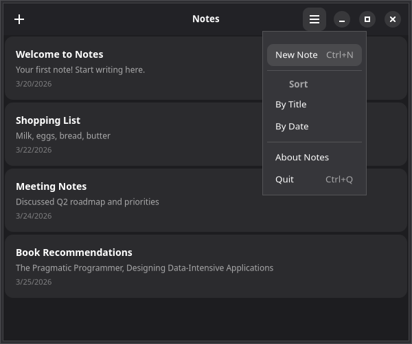

# 4. Menus & shortcuts

Desktop apps need menus and keyboard shortcuts. GTKX provides declarative components for both.



The components below live inside the `NotesWindow` from [Chapter 1](./1-window-and-header-bar.md), still wrapped in `<AdwApplication>`.

## Adding a menu

Attach a menu to a `GtkMenuButton` using the standalone `MenuItem`, `MenuSection`, and `MenuSubmenu` components as its children:

```tsx
import { GtkMenuButton, MenuItem, MenuSection } from "@gtkx/react";

<AdwHeaderBar
    packStart={
        <GtkButton iconName="list-add-symbolic" tooltipText="New Note (Ctrl+N)" onClicked={addNote} />
    }
    packEnd={
        <GtkMenuButton iconName="open-menu-symbolic" tooltipText="Main Menu">
            <MenuItem
                id="new"
                label="New Note"
                onActivate={addNote}
                accels="<Control>n"
            />
            <MenuSection>
                <MenuItem
                    id="preferences"
                    label="Preferences"
                    onActivate={() => setShowPreferences(true)}
                    accels="<Control>comma"
                />
                <MenuItem
                    id="shortcuts"
                    label="Keyboard Shortcuts"
                    onActivate={() => {}}
                    accels="<Control>question"
                />
            </MenuSection>
            <MenuSection>
                <MenuItem
                    id="about"
                    label="About Notes"
                    onActivate={() => setShowAbout(true)}
                />
            </MenuSection>
        </GtkMenuButton>
    }
/>
```

::: tip GNOME HIG Menu Guidelines
The GNOME HIG has specific recommendations for primary menus:
- Always use `open-menu-symbolic` as the icon and "Main Menu" as the tooltip
- Include **Preferences**, **Keyboard Shortcuts**, and **About** items (in that order, in a final section)
- Do **not** include "Quit" or "Close" — users close windows via the window controls
- Keep menus between 3–12 items, grouped by purpose
:::

### Menu elements

| Component | Purpose |
|-----------|---------|
| `MenuItem` | A clickable menu item with `id`, `label`, `onActivate`, and optional `accels` |
| `MenuSection` | Groups items with a visual separator and optional `label` header |
| `MenuSubmenu` | A nested submenu with its own items |

### Keyboard accelerators

The `accels` prop on `MenuItem` registers a global keyboard shortcut. GTK accelerator strings use angle brackets for modifiers:

- `"<Control>n"` — Ctrl+N
- `"<Control><Shift>z"` — Ctrl+Shift+Z
- `"<Alt>F4"` — Alt+F4
- `"F5"` — F5

## Submenus

Nest `MenuSubmenu` for hierarchical menus:

```tsx
import { GtkMenuButton, MenuItem, MenuSection, MenuSubmenu } from "@gtkx/react";

<GtkMenuButton label="File">
    <MenuItem id="new" label="New" onActivate={handleNew} />
    <MenuSubmenu label="Export As">
        <MenuItem id="export-txt" label="Plain Text" onActivate={exportTxt} />
        <MenuItem id="export-md" label="Markdown" onActivate={exportMd} />
    </MenuSubmenu>
    <MenuSection>
        <MenuItem id="quit" label="Quit" onActivate={quit} accels="<Control>q" />
    </MenuSection>
</GtkMenuButton>
```

## Application menu bar

For a traditional menu bar across the top of the window, place a `Menu` in the application's `menubar` slot and enable `showMenubar` on the window:

```tsx
import { AdwApplication, AdwApplicationWindow, Menu, MenuItem, MenuSection, MenuSubmenu, quit } from "@gtkx/react";

<AdwApplication
    applicationId="com.example.notes"
    menubar={
        <Menu>
            <MenuSubmenu label="File">
                <MenuItem id="new" label="New" onActivate={addNote} accels="<Control>n" />
                <MenuSection>
                    <MenuItem id="quit" label="Quit" onActivate={quit} accels="<Control>q" />
                </MenuSection>
            </MenuSubmenu>
        </Menu>
    }
>
    <AdwApplicationWindow title="Notes" showMenubar onClose={quit}>
        {/* ... */}
    </AdwApplicationWindow>
</AdwApplication>
```

## Keyboard shortcuts

For shortcuts not tied to menus, place `GtkShortcut` elements inside a `GtkShortcutController`. Each shortcut pairs a `trigger` (a `Gtk.ShortcutTrigger`) with an `action` (a `Gtk.ShortcutAction`). Parse accelerator strings with `Gtk.ShortcutTrigger.parseString`, and build the action with `Gtk.CallbackAction.new`, whose callback returns `true` when it handles the event:

```tsx
import { GtkBox, GtkShortcut, GtkShortcutController } from "@gtkx/react";
import * as Gtk from "@gtkx/gi/gtk";

<GtkBox orientation={Gtk.Orientation.VERTICAL} focusable>
    <GtkShortcutController scope={Gtk.ShortcutScope.GLOBAL}>
        <GtkShortcut
            trigger={Gtk.ShortcutTrigger.parseString("<Control>n")}
            action={Gtk.CallbackAction.new(() => {
                addNote();
                return true;
            })}
        />
        <GtkShortcut
            trigger={Gtk.ShortcutTrigger.parseString("<Control>f")}
            action={Gtk.CallbackAction.new(() => {
                setSearchMode(true);
                return true;
            })}
        />
        <GtkShortcut
            trigger={selectedId ? Gtk.ShortcutTrigger.parseString("Delete") : Gtk.NeverTrigger.get()}
            action={Gtk.CallbackAction.new(() => {
                deleteSelected();
                return true;
            })}
        />
    </GtkShortcutController>
    {/* ... */}
</GtkBox>
```

To disable a shortcut, swap its trigger for `Gtk.NeverTrigger.get()`, as the `Delete` shortcut above does while no note is selected.

### Shortcut scope

The `scope` prop controls when shortcuts are active:

| Scope | Behavior |
|-------|----------|
| `Gtk.ShortcutScope.LOCAL` | Only when the parent widget is focused |
| `Gtk.ShortcutScope.MANAGED` | Managed by a parent `GtkShortcutManager` |
| `Gtk.ShortcutScope.GLOBAL` | Active anywhere in the window |

### Multiple triggers

Combine two triggers on the same shortcut with `Gtk.AlternativeTrigger.new`:

```tsx
<GtkShortcut
    trigger={Gtk.AlternativeTrigger.new(
        Gtk.ShortcutTrigger.parseString("F5"),
        Gtk.ShortcutTrigger.parseString("<Control>r"),
    )}
    action={Gtk.CallbackAction.new(() => {
        refresh();
        return true;
    })}
/>
```

## Putting it together

Here's the Notes app header bar with both a menu button and keyboard shortcuts:

```tsx
import {
    AdwApplication,
    AdwApplicationWindow,
    AdwHeaderBar,
    AdwToolbarView,
    GtkButton,
    GtkMenuButton,
    GtkShortcut,
    GtkShortcutController,
    MenuItem,
    MenuSection,
    quit,
} from "@gtkx/react";
import * as Gtk from "@gtkx/gi/gtk";

function NotesWindow() {
    // ... state from previous chapters

    return (
        <AdwApplicationWindow title="Notes" defaultWidth={600} defaultHeight={500} onClose={quit}>
            <GtkShortcutController scope={Gtk.ShortcutScope.GLOBAL}>
                <GtkShortcut
                    trigger={Gtk.ShortcutTrigger.parseString("<Control>n")}
                    action={Gtk.CallbackAction.new(() => {
                        addNote();
                        return true;
                    })}
                />
                <GtkShortcut
                    trigger={selectedId ? Gtk.ShortcutTrigger.parseString("Delete") : Gtk.NeverTrigger.get()}
                    action={Gtk.CallbackAction.new(() => {
                        deleteSelected();
                        return true;
                    })}
                />
            </GtkShortcutController>
            <AdwToolbarView
                addTopBar={
                    <AdwHeaderBar
                        packStart={
                            <GtkButton
                                iconName="list-add-symbolic"
                                tooltipText="New Note (Ctrl+N)"
                                onClicked={addNote}
                            />
                        }
                        packEnd={
                            <GtkMenuButton iconName="open-menu-symbolic" tooltipText="Main Menu">
                                <MenuItem
                                    id="new"
                                    label="New Note"
                                    onActivate={addNote}
                                    accels="<Control>n"
                                />
                                <MenuSection>
                                    <MenuItem
                                        id="preferences"
                                        label="Preferences"
                                        onActivate={() => setShowPreferences(true)}
                                        accels="<Control>comma"
                                    />
                                </MenuSection>
                                <MenuSection>
                                    <MenuItem
                                        id="about"
                                        label="About Notes"
                                        onActivate={() => setShowAbout(true)}
                                    />
                                </MenuSection>
                            </GtkMenuButton>
                        }
                    />
                }
            >
                {/* ... list from previous chapter */}
            </AdwToolbarView>
        </AdwApplicationWindow>
    );
}

export function App() {
    return (
        <AdwApplication applicationId="com.example.notes">
            <NotesWindow />
        </AdwApplication>
    );
}
```

## Next

In the [next chapter](./5-navigation.md), you'll add a sidebar with categories and split-view navigation.
