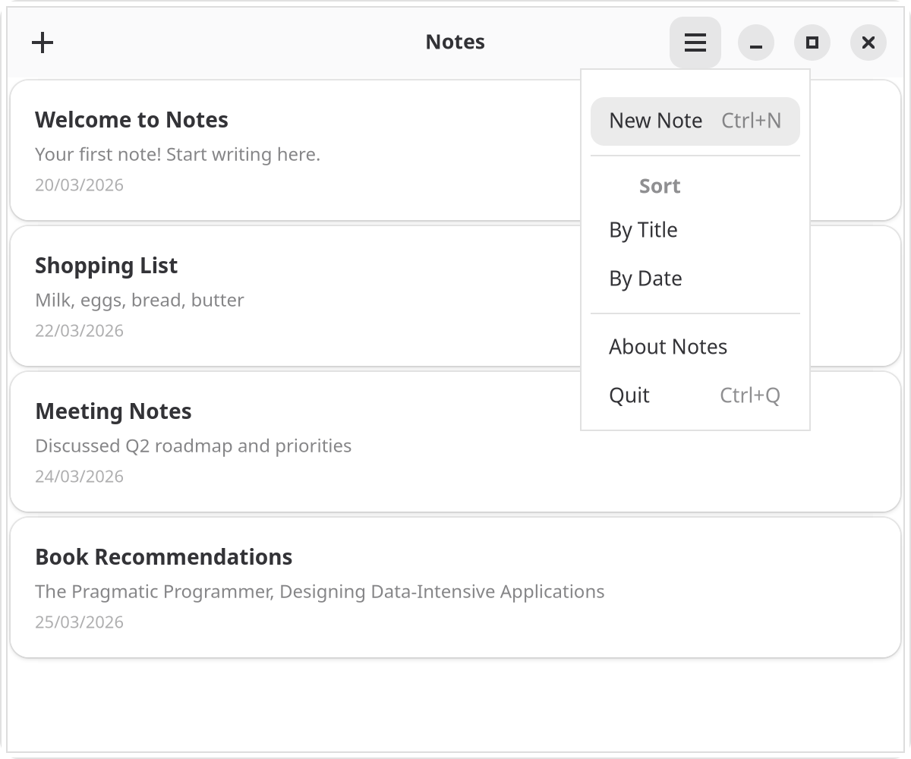
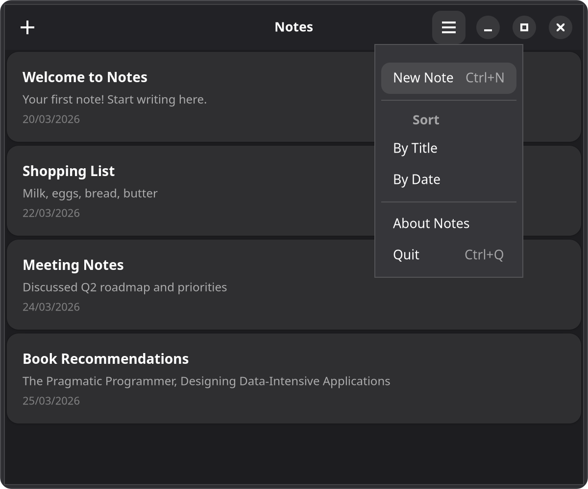

# 4. Menus & shortcuts

Desktop apps need menus and keyboard shortcuts. GTKX provides declarative components for both.

{.light-only}
{.dark-only}

The components below live inside the `NotesWindow` from [Chapter 1](./1-window-and-header-bar.md), still wrapped in `<AdwApplication>`.

## Adding a menu

Menus are data. A `<GMenu>` element (from `@gtkx/jsx/gio`) takes an `items` array of `MenuEntry` objects — `{ label?, action?, submenu?, section? }`, exported by `@gtkx/react` — and each leaf entry triggers a named action. Declare the actions as `<GSimpleAction>` elements (also from `@gtkx/jsx/gio`) through the window's `addAction` prop, then pass the menu to a `GtkMenuButton` through its `menuModel` prop:

```tsx
import { GMenu, GSimpleAction } from "@gtkx/jsx/gio";
import { GtkButton, GtkMenuButton } from "@gtkx/jsx/gtk";

// On the window — actions install under the "win." scope:
<AdwApplicationWindow
    title="Notes"
    addAction={
        <>
            <GSimpleAction name="new" onActivate={addNote} accels="<Control>n" />
            <GSimpleAction name="preferences" onActivate={() => setShowPreferences(true)} accels="<Control>comma" />
            <GSimpleAction name="shortcuts" onActivate={() => {}} accels="<Control>question" />
            <GSimpleAction name="about" onActivate={() => setShowAbout(true)} />
        </>
    }
>
    {/* ... */}
</AdwApplicationWindow>

// In the header bar — the menu references the actions by name:
<AdwHeaderBar
    packStart={
        <GtkButton iconName="list-add-symbolic" tooltipText="New Note (Ctrl+N)" onClicked={addNote} />
    }
    packEnd={
        <GtkMenuButton
            iconName="open-menu-symbolic"
            tooltipText="Main Menu"
            menuModel={
                <GMenu
                    items={[
                        { label: "New Note", action: "win.new" },
                        {
                            section: [
                                { label: "Preferences", action: "win.preferences" },
                                { label: "Keyboard Shortcuts", action: "win.shortcuts" },
                            ],
                        },
                        {
                            section: [{ label: "About Notes", action: "win.about" }],
                        },
                    ]}
                />
            }
        />
    }
/>
```

::: tip GNOME HIG Menu Guidelines
The GNOME HIG has specific recommendations for primary menus:
- Always use `open-menu-symbolic` as the icon and "Main Menu" as the tooltip
- Include **Preferences**, **Keyboard Shortcuts**, and **About** items (in that order, in a final section)
- Do **not** include "Quit" or "Close" — users close windows via the window controls
- Keep menus between 3–12 items, grouped by purpose
:::

### MenuEntry fields

| Field | Purpose |
|-----------|---------|
| `label` | The entry's display label; an underscore marks its mnemonic |
| `action` | The detailed action name a leaf entry triggers (e.g. `"win.about"`) |
| `submenu` | Nested `MenuEntry[]` rendered as this entry's submenu |
| `section` | `MenuEntry[]` grouped as an inline section, with `label` as the heading |

`Gio.Menu` is a value-snapshot model, so the menu's content is declared as plain data and rebuilt whenever the `items` array changes — drive dynamic menus by computing a new array.

### Keyboard accelerators

The `accels` prop on `GSimpleAction` registers a global keyboard shortcut for the action. GTK accelerator strings use angle brackets for modifiers:

- `"<Control>n"` — Ctrl+N
- `"<Control><Shift>z"` — Ctrl+Shift+Z
- `"<Alt>F4"` — Alt+F4
- `"F5"` — F5

## Submenus

Nest entries under `submenu` for hierarchical menus:

```tsx
import { GMenu } from "@gtkx/jsx/gio";
import { GtkMenuButton } from "@gtkx/jsx/gtk";

<GtkMenuButton
    label="File"
    menuModel={
        <GMenu
            items={[
                { label: "New", action: "win.new" },
                {
                    label: "Export As",
                    submenu: [
                        { label: "Plain Text", action: "win.export-txt" },
                        { label: "Markdown", action: "win.export-md" },
                    ],
                },
                { section: [{ label: "Quit", action: "app.quit" }] },
            ]}
        />
    }
/>
```

## Application menu bar

For a traditional menu bar across the top of the window, place a `<GMenu>` in the application's `menubar` slot and enable `showMenubar` on the window. Actions declared as direct children of the application install under the `app.` scope:

```tsx
import { AdwApplication, AdwApplicationWindow } from "@gtkx/jsx/adw";
import { GMenu, GSimpleAction } from "@gtkx/jsx/gio";
import { quit } from "@gtkx/react";

<AdwApplication
    applicationId="com.example.notes"
    menubar={
        <GMenu
            items={[
                {
                    label: "File",
                    submenu: [
                        { label: "New", action: "win.new" },
                        { section: [{ label: "Quit", action: "app.quit" }] },
                    ],
                },
            ]}
        />
    }
>
    <GSimpleAction name="quit" onActivate={quit} accels="<Control>q" />
    <AdwApplicationWindow
        title="Notes"
        showMenubar
        addAction={<GSimpleAction name="new" onActivate={addNote} accels="<Control>n" />}
        onCloseRequest={() => {
            quit();
            return true;
        }}
    >
        {/* ... */}
    </AdwApplicationWindow>
</AdwApplication>
```

## Keyboard shortcuts

For shortcuts not tied to menus, pass `GtkShortcut` elements through a `GtkShortcutController`'s `addShortcut` prop, and attach the controller through the widget's `addController` prop. Each shortcut pairs a `trigger` (a `Gtk.ShortcutTrigger`) with an `action` (a `Gtk.ShortcutAction`). Parse accelerator strings with `Gtk.ShortcutTrigger.parseString`, and build the action with `Gtk.CallbackAction.new`, whose callback returns `true` when it handles the event:

```tsx
import { GtkBox, GtkShortcut, GtkShortcutController } from "@gtkx/jsx/gtk";
import * as Gtk from "@gtkx/gi/gtk";

<GtkBox
    orientation={Gtk.Orientation.VERTICAL}
    focusable
    addController={
        <GtkShortcutController
            scope={Gtk.ShortcutScope.GLOBAL}
            addShortcut={
                <>
                    <GtkShortcut
                        trigger={Gtk.ShortcutTrigger.parseString("<Control>n")}
                        action={Gtk.CallbackAction.new(() => {
                            addNote();
                            return true;
                        })}
                    />
                    <GtkShortcut
                        trigger={Gtk.ShortcutTrigger.parseString("<Control>f")}
                        action={Gtk.CallbackAction.new(() => {
                            setSearchMode(true);
                            return true;
                        })}
                    />
                    <GtkShortcut
                        trigger={selectedId ? Gtk.ShortcutTrigger.parseString("Delete") : Gtk.NeverTrigger.get()}
                        action={Gtk.CallbackAction.new(() => {
                            deleteSelected();
                            return true;
                        })}
                    />
                </>
            }
        />
    }
>
    {/* ... */}
</GtkBox>
```

To disable a shortcut, swap its trigger for `Gtk.NeverTrigger.get()`, as the `Delete` shortcut above does while no note is selected.

### Shortcut scope

The `scope` prop controls when shortcuts are active:

| Scope | Behavior |
|-------|----------|
| `Gtk.ShortcutScope.LOCAL` | Only when the widget carrying the controller is focused |
| `Gtk.ShortcutScope.MANAGED` | Managed by a parent `GtkShortcutManager` |
| `Gtk.ShortcutScope.GLOBAL` | Active anywhere in the window |

### Multiple triggers

Combine two triggers on the same shortcut with `Gtk.AlternativeTrigger.new`:

```tsx
<GtkShortcut
    trigger={Gtk.AlternativeTrigger.new(
        Gtk.ShortcutTrigger.parseString("F5"),
        Gtk.ShortcutTrigger.parseString("<Control>r"),
    )}
    action={Gtk.CallbackAction.new(() => {
        refresh();
        return true;
    })}
/>
```

## Putting it together

Here's the Notes app header bar with both a menu button and keyboard shortcuts:

```tsx
import {
    AdwApplication,
    AdwApplicationWindow,
    AdwHeaderBar,
    AdwToolbarView,
} from "@gtkx/jsx/adw";
import { GMenu, GSimpleAction } from "@gtkx/jsx/gio";
import { GtkButton, GtkMenuButton, GtkShortcut, GtkShortcutController } from "@gtkx/jsx/gtk";
import { quit } from "@gtkx/react";
import * as Gtk from "@gtkx/gi/gtk";

function NotesWindow() {
    // ... state from previous chapters

    return (
        <AdwApplicationWindow
            title="Notes"
            defaultWidth={600}
            defaultHeight={500}
            onCloseRequest={() => {
                quit();
                return true;
            }}
            addAction={
                <>
                    <GSimpleAction name="new" onActivate={addNote} accels="<Control>n" />
                    <GSimpleAction name="preferences" onActivate={() => setShowPreferences(true)} accels="<Control>comma" />
                    <GSimpleAction name="about" onActivate={() => setShowAbout(true)} />
                </>
            }
            addController={
                <GtkShortcutController
                    scope={Gtk.ShortcutScope.GLOBAL}
                    addShortcut={
                        <GtkShortcut
                            trigger={selectedId ? Gtk.ShortcutTrigger.parseString("Delete") : Gtk.NeverTrigger.get()}
                            action={Gtk.CallbackAction.new(() => {
                                deleteSelected();
                                return true;
                            })}
                        />
                    }
                />
            }
        >
            <AdwToolbarView
                addTopBar={
                    <AdwHeaderBar
                        packStart={
                            <GtkButton
                                iconName="list-add-symbolic"
                                tooltipText="New Note (Ctrl+N)"
                                onClicked={addNote}
                            />
                        }
                        packEnd={
                            <GtkMenuButton
                                iconName="open-menu-symbolic"
                                tooltipText="Main Menu"
                                menuModel={
                                    <GMenu
                                        items={[
                                            { label: "New Note", action: "win.new" },
                                            {
                                                section: [
                                                    { label: "Preferences", action: "win.preferences" },
                                                ],
                                            },
                                            {
                                                section: [{ label: "About Notes", action: "win.about" }],
                                            },
                                        ]}
                                    />
                                }
                            />
                        }
                    />
                }
            >
                {/* ... list from previous chapter */}
            </AdwToolbarView>
        </AdwApplicationWindow>
    );
}

export function App() {
    return (
        <AdwApplication applicationId="com.example.notes">
            <NotesWindow />
        </AdwApplication>
    );
}
```

For context menus, menu bars rendered as widgets, and action groups with custom prefixes, see the [Menus, actions & shortcuts guide](/docs/guides/menus-and-actions).

## Next

In the [next chapter](./5-navigation.md), you'll add a sidebar with categories and split-view navigation.

## Checkpoint

- You should now have a primary menu in the header bar whose entries trigger `win.`-scoped actions.
- You should see accelerators like Ctrl+N rendered next to their menu items, and pressing them should fire the actions.
- You should be able to add window-level shortcuts with `GtkShortcutController`, including conditionally disabled ones via `Gtk.NeverTrigger`.

The complete app this tutorial builds lives at [examples/tutorial](https://github.com/gtkx-org/gtkx/tree/main/examples/tutorial).
