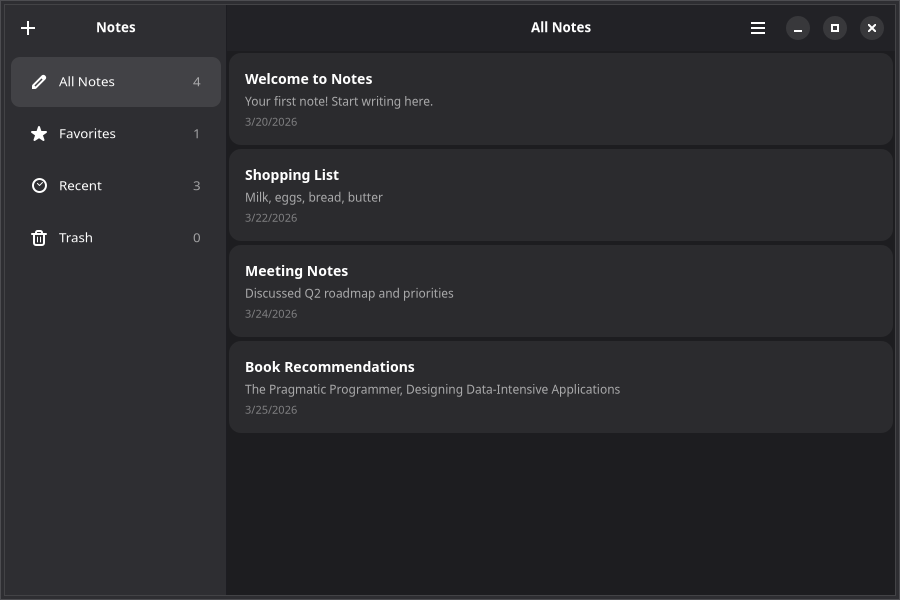

# 5. Navigation & Split Views

A notes app benefits from a sidebar for organizing notes into categories. Adwaita provides `AdwNavigationSplitView` for responsive sidebar/content layouts and `AdwViewStack` for tabbed views.



## Split View Layout

`AdwNavigationSplitView` creates a two-pane layout with a sidebar and content area. Each pane is declared with an `AdwNavigationSplitView.Page` compound component:

```tsx
import {
    AdwApplicationWindow,
    AdwHeaderBar,
    AdwNavigationSplitView,
    AdwToolbarView,
    GtkBox,
    GtkLabel,
    quit,
} from "@gtkx/react";

export default function App() {
    return (
        <AdwApplicationWindow title="Notes" defaultWidth={800} defaultHeight={600} onClose={quit}>
            <AdwNavigationSplitView
                sidebarWidthFraction={0.3}
                minSidebarWidth={200}
                maxSidebarWidth={350}
            >
                <AdwNavigationSplitView.Page id="sidebar" title="Notes">
                    <AdwToolbarView addTopBar={<AdwHeaderBar />}>
                        <GtkLabel label="Sidebar content" />
                    </AdwToolbarView>
                </AdwNavigationSplitView.Page>

                <AdwNavigationSplitView.Page id="content" title="Editor">
                    <AdwToolbarView addTopBar={<AdwHeaderBar />}>
                        <GtkLabel label="Content area" />
                    </AdwToolbarView>
                </AdwNavigationSplitView.Page>
            </AdwNavigationSplitView>
        </AdwApplicationWindow>
    );
}
```

The split view automatically collapses to a single pane on narrow windows, with back-navigation to return to the sidebar.

## Building the Sidebar

Add category navigation using `GtkListBox` with Adwaita action rows:

```tsx
import {
    AdwActionRow,
    GtkImage,
    GtkLabel,
    GtkListBox,
    GtkScrolledWindow,
} from "@gtkx/react";

interface Category {
    id: string;
    title: string;
    icon: string;
}

const categories: Category[] = [
    { id: "all", title: "All Notes", icon: "document-edit-symbolic" },
    { id: "favorites", title: "Favorites", icon: "starred-symbolic" },
    { id: "recent", title: "Recent", icon: "document-open-recent-symbolic" },
    { id: "trash", title: "Trash", icon: "user-trash-symbolic" },
];

const Sidebar = ({
    noteCounts,
    onCategoryChanged,
}: {
    noteCounts: Record<string, number>;
    onCategoryChanged: (id: string) => void;
}) => (
    <GtkScrolledWindow vexpand>
        <GtkListBox
            cssClasses={["navigation-sidebar"]}
            onRowSelected={(row) => {
                if (!row) return;
                const category = categories[row.getIndex()];
                if (category) onCategoryChanged(category.id);
            }}
        >
            {categories.map((cat) => (
                <AdwActionRow
                    key={cat.id}
                    title={cat.title}
                    addPrefix={<GtkImage iconName={cat.icon} />}
                    addSuffix={<GtkLabel label={String(noteCounts[cat.id] ?? 0)} cssClasses={["dim-label"]} />}
                />
            ))}
        </GtkListBox>
    </GtkScrolledWindow>
);
```

Notice the `addPrefix` and `addSuffix` props on `AdwActionRow` — these are slot props for placing widgets at the start and end of an action row.

## Stack Navigation

For tabbed views within a pane, use `AdwViewStack` with `AdwViewStack.Page` and an `AdwViewSwitcher`:

```tsx
import { AdwHeaderBar, AdwToolbarView, AdwViewStack, AdwViewSwitcher } from "@gtkx/react";
import * as Adw from "@gtkx/ffi/adw";
import * as Gtk from "@gtkx/ffi/gtk";
import { useState } from "react";

const ContentPane = () => {
    const [stack, setStack] = useState<Adw.ViewStack | null>(null);
    const [page, setPage] = useState("list");

    return (
        <AdwToolbarView
            addTopBar={<AdwHeaderBar titleWidget={<AdwViewSwitcher stack={stack} />} />}
        >
            <AdwViewStack ref={setStack} page={page} onPageChanged={setPage}>
                <AdwViewStack.Page id="list" title="List" iconName="view-list-symbolic">
                    {/* Notes list from previous chapters */}
                </AdwViewStack.Page>
                <AdwViewStack.Page id="grid" title="Grid" iconName="view-grid-symbolic">
                    {/* Grid view of notes */}
                </AdwViewStack.Page>
            </AdwViewStack>
        </AdwToolbarView>
    );
};
```

The `AdwViewSwitcher` automatically renders tabs that correspond to the stack pages. Link them via the `ref`/`stack` pattern shown above.

## Stack-Based Navigation

For push/pop navigation (like navigating into a note detail view), use `AdwNavigationView`:

```tsx
import { AdwNavigationView } from "@gtkx/react";
import { useState } from "react";

const NotesBrowser = () => {
    const [history, setHistory] = useState(["list"]);

    const pushNote = (noteId: string) => {
        setHistory([...history, `note-${noteId}`]);
    };

    const pop = () => {
        setHistory(history.slice(0, -1));
    };

    return (
        <AdwNavigationView history={history} onHistoryChanged={setHistory}>
            <AdwNavigationView.Page id="list" title="Notes">
                <AdwToolbarView addTopBar={<AdwHeaderBar />}>
                    {/* Notes list — onClick calls pushNote(id) */}
                </AdwToolbarView>
            </AdwNavigationView.Page>

            <AdwNavigationView.Page id={`note-${selectedNote?.id}`} title={selectedNote?.title ?? ""}>
                <AdwToolbarView addTopBar={<AdwHeaderBar />}>
                    {/* Note editor */}
                </AdwToolbarView>
            </AdwNavigationView.Page>
        </AdwNavigationView>
    );
};
```

The `AdwHeaderBar` inside a navigation page automatically shows a back button when there's history to pop.

## Complete Layout

Here's how the pieces fit together:

```tsx
export default function App() {
    const [notes] = useState<Note[]>([ /* ... */ ]);
    const [category, setCategory] = useState("all");
    const [selectedId, setSelectedId] = useState<string | null>(null);

    const selectedNote = notes.find((n) => n.id === selectedId);

    const categoryTitles: Record<string, string> = {
        all: "All Notes",
        favorites: "Favorites",
        recent: "Recent",
        trash: "Trash",
    };

    return (
        <AdwApplicationWindow title="Notes" defaultWidth={900} defaultHeight={600} onClose={quit}>
            <AdwNavigationSplitView
                sidebarWidthFraction={0.25}
                minSidebarWidth={200}
                maxSidebarWidth={300}
            >
                <AdwNavigationSplitView.Page id="sidebar" title="Notes">
                    <AdwToolbarView
                        addTopBar={
                            <AdwHeaderBar
                                packStart={
                                    <GtkButton iconName="list-add-symbolic" tooltipText="New Note (Ctrl+N)" onClicked={addNote} />
                                }
                            />
                        }
                    >
                        <Sidebar
                            noteCounts={{ all: notes.length, favorites: 0, recent: notes.length, trash: 0 }}
                            onCategoryChanged={setCategory}
                        />
                    </AdwToolbarView>
                </AdwNavigationSplitView.Page>

                <AdwNavigationSplitView.Page
                    id="content"
                    title={selectedNote?.title ?? categoryTitles[category] ?? "Notes"}
                >
                    <AdwToolbarView
                        addTopBar={
                            <AdwHeaderBar
                                packEnd={
                                    <GtkMenuButton iconName="open-menu-symbolic" tooltipText="Main Menu">
                                        {/* ... menu items */}
                                    </GtkMenuButton>
                                }
                            />
                        }
                    >
                        {/* Notes list filtered by category */}
                    </AdwToolbarView>
                </AdwNavigationSplitView.Page>
            </AdwNavigationSplitView>
        </AdwApplicationWindow>
    );
}
```

## Search

Most content-centric GNOME apps provide search. `GtkSearchBar` slides into view when activated and connects to a `GtkSearchEntry`:

```tsx
import { GtkButton, GtkSearchBar, GtkSearchEntry } from "@gtkx/react";
import * as Gtk from "@gtkx/ffi/gtk";
import { useRef, useState } from "react";

const [searchMode, setSearchMode] = useState(false);
const [searchQuery, setSearchQuery] = useState("");
const searchEntryRef = useRef<Gtk.SearchEntry | null>(null);

// Add a search button to the header bar:
<AdwHeaderBar
    packStart={
        <GtkButton
            iconName="system-search-symbolic"
            tooltipText="Search (Ctrl+F)"
            onClicked={() => setSearchMode(!searchMode)}
        />
    }
/>

// Place the search bar below the header bar, inside the content area:
<GtkSearchBar
    searchModeEnabled={searchMode}
    onSearchModeChanged={setSearchMode}
    keyCaptureWidget={searchEntryRef.current}
>
    <GtkSearchEntry
        ref={searchEntryRef}
        placeholderText="Search notes…"
        onSearchChanged={(self) => setSearchQuery(self.text ?? "")}
    />
</GtkSearchBar>
```

Then filter your data based on `searchQuery`:

```tsx
const filteredNotes = searchQuery
    ? notes.filter(
          (n) =>
              n.title.toLowerCase().includes(searchQuery.toLowerCase()) ||
              n.body.toLowerCase().includes(searchQuery.toLowerCase()),
      )
    : notes;
```

When the list is empty, show a search-specific `AdwStatusPage`:

```tsx
<AdwStatusPage
    vexpand
    iconName={searchQuery ? "system-search-symbolic" : "document-edit-symbolic"}
    title={searchQuery ? "No Results Found" : "No Notes Yet"}
    description={searchQuery ? `No notes match "${searchQuery}"` : "Press + or Ctrl+N to create your first note"}
/>
```

## Next

In the [next chapter](./6-dialogs-and-animations.md), you'll add confirmation dialogs and smooth animations.
