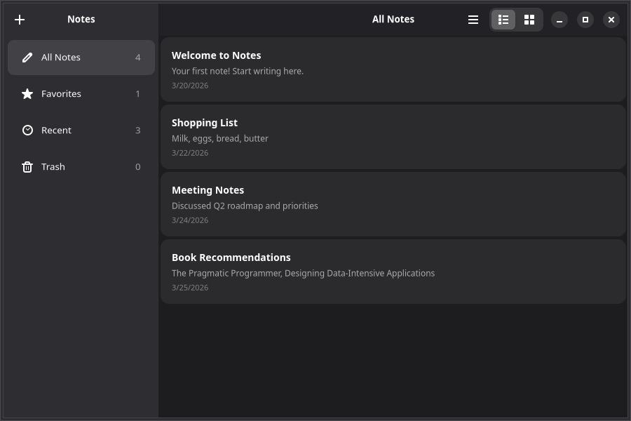

# 6. Dialogs & animations

Let's add confirmation dialogs for destructive actions and smooth animations for a polished feel.



The components below live inside the `NotesWindow` from [Chapter 1](./1-window-and-header-bar.md), still wrapped in `<AdwApplication>`.

## Confirmation dialogs

Use `AdwAlertDialog` with the `responses` prop and `createPortal` to show it on the active window:

```tsx
import { AdwAlertDialog } from "@gtkx/jsx/adw";
import { createPortal, useApplication, useProperty } from "@gtkx/react";
import * as Adw from "@gtkx/gi/adw";
import { useState } from "react";

const DeleteConfirmation = ({
    noteTitle,
    onConfirm,
    onCancel,
}: {
    noteTitle: string;
    onConfirm: () => void;
    onCancel: () => void;
}) => {
    const app = useApplication();
    const activeWindow = useProperty(app, "activeWindow");

    if (!activeWindow) return null;

    return createPortal(
        <AdwAlertDialog
            heading="Delete Note?"
            body={`"${noteTitle}" will be permanently deleted.`}
            responses={[
                { id: "cancel", label: "Cancel" },
                { id: "delete", label: "Delete", appearance: Adw.ResponseAppearance.DESTRUCTIVE },
            ]}
            defaultResponse="cancel"
            closeResponse="cancel"
            onResponse={(id) => {
                if (id === "delete") onConfirm();
                else onCancel();
            }}
        />,
        activeWindow,
    );
};
```

### Using the dialog

```tsx
const [noteToDelete, setNoteToDelete] = useState<Note | null>(null);

const deleteNote = (note: Note) => {
    setNoteToDelete(note);
};

const confirmDelete = () => {
    if (noteToDelete) {
        setNotes(notes.filter((n) => n.id !== noteToDelete.id));
        if (selectedId === noteToDelete.id) setSelectedId(null);
        setNoteToDelete(null);
    }
};

// In JSX:
{noteToDelete && (
    <DeleteConfirmation
        noteTitle={noteToDelete.title}
        onConfirm={confirmDelete}
        onCancel={() => setNoteToDelete(null)}
    />
)}
```

### Portals

`createPortal` renders a component as a child of a different GTK widget, outside the normal React tree. This is necessary for dialogs, which GTK requires to be children of a window — not nested deep inside other widgets.

See the [Portals](../portals.md) guide for more details.

## Toggle groups

Let the user switch between list and grid views using `AdwToggleGroup` with `AdwToggle` children:

```tsx
import { AdwToggle, AdwToggleGroup } from "@gtkx/jsx/adw";

<AdwToggleGroup activeName={viewMode} onNotifyActiveName={(name) => setViewMode(name ?? "list")}>
    <AdwToggle name="list" iconName="view-list-symbolic" tooltip="List View" />
    <AdwToggle name="grid" iconName="view-grid-symbolic" tooltip="Grid View" />
</AdwToggleGroup>
```

Each `AdwToggle` carries a `name`, a `label` or `iconName`, and an optional `tooltip`. The group's `activeName` matches the active toggle's `name`.

## Grid view

Use `GtkGridView` to render items in a multi-column grid. It shares the same data API as `GtkListView` — `items`, `renderItem`, `selected`, and `onSelectionChanged` all work identically:

```tsx
import { GtkGridView, GtkListView, GtkScrolledWindow } from "@gtkx/jsx/gtk";

<GtkScrolledWindow vexpand>
    {viewMode === "list" ? (
        <GtkListView
            estimatedItemHeight={80}
            selectionMode={Gtk.SelectionMode.SINGLE}
            selected={selectedId ? [selectedId] : []}
            onSelectionChanged={(ids) => setSelectedId(ids[0] ?? null)}
            items={filteredNotes.map((note) => ({ id: note.id, value: note }))}
            renderItem={(note) => <NoteCard note={note} />}
        />
    ) : (
        <GtkGridView
            minColumns={2}
            maxColumns={4}
            selectionMode={Gtk.SelectionMode.SINGLE}
            selected={selectedId ? [selectedId] : []}
            onSelectionChanged={(ids) => setSelectedId(ids[0] ?? null)}
            items={filteredNotes.map((note) => ({ id: note.id, value: note }))}
            renderItem={(note) => <NoteCard note={note} />}
        />
    )}
</GtkScrolledWindow>
```

`GtkGridView` adds two layout props:

- **`minColumns`** — Minimum number of columns (items wrap to the next row)
- **`maxColumns`** — Maximum number of columns (prevents overly wide layouts)

## Timed animations

Wrap a widget with `AdwTimedAnimation` to animate its properties over a fixed duration:

```tsx
import { AdwTimedAnimation } from "@gtkx/animate";
import { GtkBox } from "@gtkx/jsx/gtk";
import * as Adw from "@gtkx/gi/adw";

const NoteCard = ({ note }: { note: Note }) => (
    <AdwTimedAnimation
        initial={{ opacity: 0, translateY: -10 }}
        animate={{ opacity: 1, translateY: 0 }}
        exit={{ opacity: 0, translateX: -50 }}
        duration={200}
        easing={Adw.Easing.EASE_OUT_CUBIC}
        animateOnMount
    >
        <GtkBox orientation={Gtk.Orientation.VERTICAL} spacing={4} cssClasses={[noteCard]}>
            <GtkLabel label={note.title} halign={Gtk.Align.START} cssClasses={[noteTitle]} />
            <GtkLabel label={note.body || "Empty note"} halign={Gtk.Align.START} cssClasses={[notePreview]} />
        </GtkBox>
    </AdwTimedAnimation>
);
```

### Animation props

- **`initial`** — Starting values (set immediately on mount)
- **`animate`** — Target values (animated toward)
- **`duration`** — Animation length in milliseconds
- **`easing`** — Easing curve from `Adw.Easing`
- **`delay`** — Delay before starting
- **`animateOnMount`** — Whether to animate when the component first renders

Animatable properties: `opacity`, `translateX`, `translateY`, `scale`, `scaleX`, `scaleY`, `rotate`, `skewX`, `skewY`.

::: tip
Animation components work with regular widget children. They cannot be used inside `GtkListView`'s `renderItem` — instead, animate the list container or use animations on views that are rendered directly in a `GtkBox`.
:::

## Spring animations

`AdwSpringAnimation` uses physics simulation for natural-feeling motion:

```tsx
import { AdwSpringAnimation } from "@gtkx/animate";
import { GtkButton } from "@gtkx/jsx/gtk";

<AdwSpringAnimation
    initial={{ scale: 0.8 }}
    animate={{ scale: 1 }}
    damping={0.7}
    stiffness={300}
    animateOnMount
>
    <GtkButton label="Add Note" cssClasses={["suggested-action"]} onClicked={addNote} />
</AdwSpringAnimation>
```

Spring parameters:

- **`damping`** — How quickly oscillation settles (0 = undamped, 1 = critically damped)
- **`stiffness`** — Spring force (higher = snappier)
- **`mass`** — Simulated mass (higher = more inertia, defaults to 1)

## Animating on prop changes

When the `animate` prop changes, the animation automatically runs to the new values:

```tsx
const [expanded, setExpanded] = useState(false);

<AdwSpringAnimation animate={{ scale: expanded ? 1.1 : 1 }} damping={0.7} stiffness={250}>
    <GtkButton label="Expand" onClicked={() => setExpanded(!expanded)} />
</AdwSpringAnimation>
```

## Exit animations

Use the `exit` prop to animate when a component unmounts:

```tsx
const NoteCard = ({ note }: { note: Note }) => (
    <AdwTimedAnimation
        initial={{ opacity: 0, translateY: -10 }}
        animate={{ opacity: 1, translateY: 0 }}
        exit={{ opacity: 0, translateX: -50 }}
        duration={200}
        animateOnMount
    >
        <GtkBox cssClasses={[noteCard]}>
            <GtkLabel label={note.title} />
        </GtkBox>
    </AdwTimedAnimation>
);
```

The widget stays mounted during the exit animation and is removed after it completes.

## Skipping initial animation

Set `initial={false}` to start at the `animate` values without an entrance animation:

```tsx
<AdwTimedAnimation initial={false} animate={{ opacity: isActive ? 1 : 0.5 }}>
    <GtkLabel label="Only animates on changes" />
</AdwTimedAnimation>
```

## Animation callbacks

Monitor animation lifecycle:

```tsx
<AdwSpringAnimation
    animate={{ opacity: 1 }}
    onAnimationStart={() => console.log("Started")}
    onAnimationComplete={() => console.log("Finished")}
    animateOnMount
>
    <GtkButton label="Animated" />
</AdwSpringAnimation>
```

## Custom animations with `useTickCallback`

The animation components cover property transitions. For fully custom per-frame work — driving a `GtkDrawingArea`, sampling frame timings, running your own simulation — the `useTickCallback` hook registers a frame-clock tick on a widget and removes it automatically on unmount or when the target widget changes.

The callback fires once per frame while the widget is mapped, receiving the widget and its `Gdk.FrameClock`. Return `true` to keep ticking or `false` to stop:

```tsx
import type * as Gtk from "@gtkx/gi/gtk";
import { GtkDrawingArea } from "@gtkx/jsx/gtk";
import { useTickCallback } from "@gtkx/react";
import { useRef } from "react";

const SpinningDial = () => {
    const areaRef = useRef<Gtk.DrawingArea | null>(null);
    const angleRef = useRef(0);

    useTickCallback(areaRef, (widget, frameClock) => {
        angleRef.current = frameClock.getFrameTime() / 1_000_000;
        widget.queueDraw();
        return true;
    });

    return (
        <GtkDrawingArea
            ref={areaRef}
            contentWidth={100}
            contentHeight={100}
            drawFunc={(self, cr, width, height) => {
                cr.translate(width / 2, height / 2);
                cr.rotate(angleRef.current);
                cr.moveTo(0, 0);
                cr.lineTo(0, -40);
                cr.stroke();
            }}
        />
    );
};
```

`GtkDrawingArea` draws through its `drawFunc` prop, with the GIR signature `(self, cr, width, height)`; changing the callback's identity queues a redraw.

The target may be the widget itself, a React ref to a JSX widget (the registration follows the ref, reattaching when a later commit replaces the widget), or `null`/`undefined` to keep the hook inactive. The latest callback is always invoked, so changing it between renders never re-registers the tick.

## Toast notifications

After a destructive action like deleting a note, show a toast notification with an undo option. Wrap the content area in `AdwToastOverlay` and create `Adw.Toast` objects imperatively:

```tsx
import * as Adw from "@gtkx/gi/adw";
import { AdwToastOverlay } from "@gtkx/jsx/adw";
import { useRef } from "react";

const toastOverlayRef = useRef<Adw.ToastOverlay | null>(null);

const confirmDelete = () => {
    if (!noteToDelete) return;

    const deletedNote = noteToDelete;
    const deletedIndex = notes.indexOf(deletedNote);
    setNotes(notes.filter((n) => n.id !== deletedNote.id));
    setNoteToDelete(null);

    const toast = Adw.Toast.new(`"${deletedNote.title}" deleted`);
    toast.buttonLabel = "Undo";
    toast.once("button-clicked", () => {
        setNotes((prev) => {
            const restored = [...prev];
            restored.splice(deletedIndex, 0, deletedNote);
            return restored;
        });
    });
    toastOverlayRef.current?.addToast(toast);
};

// In JSX — wrap your content area:
<AdwToastOverlay ref={toastOverlayRef}>
    {/* ... notes list and empty state */}
</AdwToastOverlay>
```

::: tip When to Use Toasts
The GNOME HIG recommends toasts for short-lived event messages and one-time notifications. For persistent states (like "offline mode"), use `AdwBanner` instead. Toasts with an undo button are the preferred pattern for destructive actions — they let users recover from mistakes without a confirmation dialog slowing them down.
:::

## About dialog

Every GNOME app should have an About dialog, accessible from the primary menu. Use `AdwAboutDialog` to display app name, version, credits, and license:

```tsx
import * as Gtk from "@gtkx/gi/gtk";
import { AdwAboutDialog } from "@gtkx/jsx/adw";
import { createPortal, useApplication, useProperty } from "@gtkx/react";

const About = ({ onClose }: { onClose: () => void }) => {
    const app = useApplication();
    const activeWindow = useProperty(app, "activeWindow");

    if (!activeWindow) return null;

    return createPortal(
        <AdwAboutDialog
            applicationName="Notes"
            applicationIcon="document-edit-symbolic"
            version="0.1.0"
            developerName="GTKX Tutorial"
            website="https://gtkx.dev"
            copyright="© 2026 GTKX Contributors"
            licenseType={Gtk.License.MIT_X11}
            developers={["GTKX Contributors"]}
            onClosed={onClose}
        />,
        activeWindow,
    );
};
```

Then wire it up from the `win.about` action declared in [Chapter 4](./4-menus-and-shortcuts.md):

```tsx
const [showAbout, setShowAbout] = useState(false);

// In the window's addAction prop:
<GSimpleAction name="about" onActivate={() => setShowAbout(true)} />

// In your JSX:
{showAbout && <About onClose={() => setShowAbout(false)} />}
```

The menu entry `{ label: "About Notes", action: "win.about" }` triggers the action, which flips the state; the `About` component's `onClose` callback flips it back when the dialog closes.

## Next

In the [next chapter](./7-settings-and-preferences.md), you'll add a preferences dialog that reads and writes system settings.
