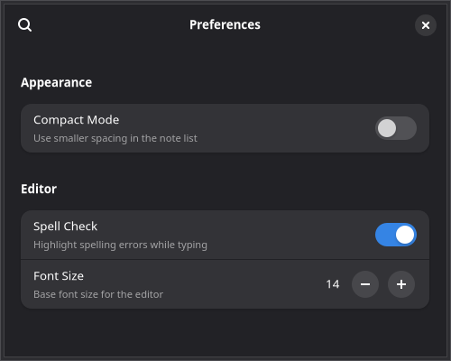

# 7. Settings & Preferences



Most desktop apps need a preferences dialog. GTKX provides `useProperty` and `useSetting` hooks to reactively bind your UI to GObject properties and GSettings values.

## Adding a Preferences Menu Item

First, add a "Preferences" item to the menu button from [Chapter 4](./4-menus-and-shortcuts.md):

```tsx
<GtkMenuButton iconName="open-menu-symbolic">
    <GtkMenuButton.MenuItem
        id="new"
        label="New Note"
        onActivate={addNote}
        accels="<Control>n"
    />
    <GtkMenuButton.MenuSection>
        <GtkMenuButton.MenuItem
            id="preferences"
            label="Preferences"
            onActivate={() => setShowPreferences(true)}
            accels="<Control>comma"
        />
    </GtkMenuButton.MenuSection>
    <GtkMenuButton.MenuSection>
        <GtkMenuButton.MenuItem
            id="about"
            label="About Notes"
            onActivate={() => setShowAbout(true)}
        />
        <GtkMenuButton.MenuItem
            id="quit"
            label="Quit"
            onActivate={quit}
            accels="<Control>q"
        />
    </GtkMenuButton.MenuSection>
</GtkMenuButton>
```

## The Preferences Dialog

Libadwaita provides a ready-made preferences window built from `AdwPreferencesWindow`, `AdwPreferencesPage`, and `AdwPreferencesGroup`. Show it as a portal on the active window:

```tsx
import {
    AdwPreferencesGroup,
    AdwPreferencesPage,
    AdwPreferencesWindow,
    AdwSwitchRow,
    AdwComboRow,
    AdwSpinRow,
    createPortal,
    useApplication,
    useProperty,
    useSetting,
} from "@gtkx/react";

const Preferences = ({ onClose }: { onClose: () => void }) => {
    const app = useApplication();
    const activeWindow = useProperty(app, "activeWindow");

    if (!activeWindow) return null;

    return createPortal(
        <AdwPreferencesWindow
            title="Preferences"
            modal
            defaultWidth={500}
            defaultHeight={400}
            onCloseRequest={onClose}
        >
            <AdwPreferencesPage title="General" iconName="preferences-system-symbolic">
                <AdwPreferencesGroup title="Appearance">
                    <AdwSwitchRow
                        title="Compact Mode"
                        subtitle="Use smaller spacing in the note list"
                    />
                </AdwPreferencesGroup>
                <AdwPreferencesGroup title="Editor">
                    <AdwSwitchRow
                        title="Spell Check"
                        subtitle="Highlight spelling errors while typing"
                    />
                    <AdwSpinRow
                        title="Font Size"
                        subtitle="Base font size for the editor"
                        value={14}
                        lower={8}
                        upper={32}
                        stepIncrement={1}
                    />
                </AdwPreferencesGroup>
            </AdwPreferencesPage>
        </AdwPreferencesWindow>,
        activeWindow,
    );
};
```

### Preferences Widgets

| Component | Purpose |
|-----------|---------|
| `AdwPreferencesWindow` | Top-level dialog with search and navigation |
| `AdwPreferencesPage` | A page with `title` and `iconName`, shown in the sidebar when there are multiple pages |
| `AdwPreferencesGroup` | A titled group of rows |
| `AdwSwitchRow` | A row with a toggle switch |
| `AdwSpinRow` | A row with a numeric spin button |
| `AdwComboRow` | A row with a dropdown selector |

## Reading System Settings with `useSetting`

The `useSetting` hook subscribes to a GSettings key and returns its value as React state. When the setting changes (even from outside your app), the component re-renders automatically.

```tsx
import { useSetting } from "@gtkx/react";

function ThemeIndicator() {
    const colorScheme = useSetting("org.gnome.desktop.interface", "color-scheme", "string");

    return <GtkLabel label={colorScheme === "prefer-dark" ? "Dark mode" : "Light mode"} />;
}
```

### Supported Types

The third argument selects the GSettings getter used to read the value:

| Type | Returns | GSettings Method |
|------|---------|-----------------|
| `"boolean"` | `boolean` | `getBoolean()` |
| `"int"` | `number` | `getInt()` |
| `"double"` | `number` | `getDouble()` |
| `"string"` | `string` | `getString()` |
| `"strv"` | `string[]` | `getStrv()` |

## Observing GObject Properties with `useProperty`

The `useProperty` hook subscribes to any GObject property via the `notify::` signal. It returns the current value and re-renders whenever the property changes.

```tsx
import { useApplication, useProperty } from "@gtkx/react";

function WindowTitle() {
    const app = useApplication();
    const activeWindow = useProperty(app, "activeWindow");
    const title = useProperty(activeWindow, "title");

    return <GtkLabel label={title ?? "No window"} />;
}
```

The return type is inferred from the ES6 accessor on the object — `useProperty(app, "activeWindow")` returns `Gtk.Window | null` without any manual type annotation. When the first argument is `null` or `undefined`, the hook returns `undefined` and skips signal subscription, so you can safely chain calls without conditional hooks.

### How It Works

1. Reads the initial value synchronously via the ES6 accessor
2. Connects to `notify::property-name` on the GObject
3. On each notification, re-reads the property and updates React state
4. Disconnects the signal on unmount or when inputs change

## Wiring Preferences to Settings

Here's a complete preferences dialog that reads and writes GSettings values:

```tsx
import * as Gio from "@gtkx/ffi/gio";
import { useMemo } from "react";

const Preferences = ({ onClose }: { onClose: () => void }) => {
    const app = useApplication();
    const activeWindow = useProperty(app, "activeWindow");
    const settings = useMemo(() => new Gio.Settings("com.example.notes"), []);

    const compactMode = useSetting("com.example.notes", "compact-mode", "boolean");
    const spellCheck = useSetting("com.example.notes", "spell-check", "boolean");
    const fontSize = useSetting("com.example.notes", "font-size", "int");

    if (!activeWindow) return null;

    return createPortal(
        <AdwPreferencesWindow
            title="Preferences"
            modal
            defaultWidth={500}
            defaultHeight={400}
            onCloseRequest={onClose}
        >
            <AdwPreferencesPage title="General" iconName="preferences-system-symbolic">
                <AdwPreferencesGroup title="Appearance">
                    <AdwSwitchRow
                        title="Compact Mode"
                        subtitle="Use smaller spacing in the note list"
                        active={compactMode}
                        onActiveChanged={(active) => settings.setBoolean("compact-mode", active)}
                    />
                </AdwPreferencesGroup>
                <AdwPreferencesGroup title="Editor">
                    <AdwSwitchRow
                        title="Spell Check"
                        subtitle="Highlight spelling errors while typing"
                        active={spellCheck}
                        onActiveChanged={(active) => settings.setBoolean("spell-check", active)}
                    />
                    <AdwSpinRow
                        title="Font Size"
                        subtitle="Base font size for the editor"
                        value={fontSize}
                        lower={8}
                        upper={32}
                        stepIncrement={1}
                        onValueChanged={(value) => settings.setInt("font-size", value)}
                    />
                </AdwPreferencesGroup>
            </AdwPreferencesPage>
        </AdwPreferencesWindow>,
        activeWindow,
    );
};
```

Each `useSetting` call subscribes to the `changed::key` signal on the GSettings backend. When a value is written with `settings.setBoolean(...)`, the signal fires and the hook updates the React state. This keeps the UI in sync even if the setting is changed externally (for example via `gsettings set` in a terminal or `dconf-editor`).

::: tip
GSettings requires a schema installed on the system. During development, use `glib-compile-schemas` to compile your `.gschema.xml` file and set `GSETTINGS_SCHEMA_DIR` to its location. GTKX's `gtkx dev` command handles this automatically when your schema is in the project root.
:::

## Next

In the [final chapter](./8-deploying.md), you'll package the Notes app for distribution.
