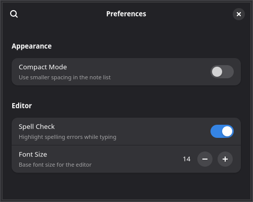

# 7. Settings & preferences



Most desktop apps need a preferences dialog. GTKX provides `useProperty`, `useSetting`, and `useSignal` hooks to reactively bind your UI to GObject properties, GSettings values, and signals.

The components below live inside the `NotesWindow` from [Chapter 1](./1-window-and-header-bar.md), still wrapped in `<AdwApplication>`.

## Adding a preferences menu item

First, add a "Preferences" item to the menu button from [Chapter 4](./4-menus-and-shortcuts.md):

```tsx
import { GtkMenuButton, MenuItem, MenuSection } from "@gtkx/react";

<GtkMenuButton iconName="open-menu-symbolic" tooltipText="Main Menu">
    <MenuItem
        id="new"
        label="New Note"
        onActivate={addNote}
        accels="<Control>n"
    />
    <MenuSection>
        <MenuItem
            id="preferences"
            label="Preferences"
            onActivate={() => setShowPreferences(true)}
            accels="<Control>comma"
        />
        <MenuItem
            id="shortcuts"
            label="Keyboard Shortcuts"
            onActivate={() => {}}
            accels="<Control>question"
        />
    </MenuSection>
    <MenuSection>
        <MenuItem
            id="about"
            label="About Notes"
            onActivate={() => setShowAbout(true)}
        />
    </MenuSection>
</GtkMenuButton>
```

## Defining a GSettings schema

GSettings needs a schema that declares your keys, their types, and default values. Create a `.gschema.xml` file in your project root — `gtkx dev` will compile it automatically:

```xml
<!-- com.example.notes.gschema.xml -->
<?xml version="1.0" encoding="UTF-8"?>
<schemalist>
  <schema id="com.example.notes" path="/com/example/notes/">
    <key name="compact-mode" type="b">
      <default>false</default>
      <summary>Compact mode</summary>
      <description>Use smaller spacing in the note list</description>
    </key>
    <key name="spell-check" type="b">
      <default>true</default>
      <summary>Spell check</summary>
      <description>Highlight spelling errors while typing</description>
    </key>
    <key name="font-size" type="i">
      <default>14</default>
      <summary>Font size</summary>
      <description>Base font size for the editor</description>
    </key>
  </schema>
</schemalist>
```

## The preferences dialog

Libadwaita provides a ready-made preferences window built from `AdwPreferencesWindow`, `AdwPreferencesPage`, and `AdwPreferencesGroup`. Show it as a portal on the active window:

```tsx
import {
    AdwPreferencesGroup,
    AdwPreferencesPage,
    AdwPreferencesWindow,
    AdwSwitchRow,
    AdwComboRow,
    AdwSpinRow,
    createPortal,
    useAdjustment,
    useApplication,
    useProperty,
} from "@gtkx/react";

const Preferences = ({ onClose }: { onClose: () => void }) => {
    const app = useApplication();
    const activeWindow = useProperty(app, "activeWindow");
    const fontSizeAdjustment = useAdjustment({ value: 14, lower: 8, upper: 32, stepIncrement: 1 });

    if (!activeWindow) return null;

    return createPortal(
        <AdwPreferencesWindow
            title="Preferences"
            modal
            defaultWidth={500}
            defaultHeight={400}
            onClose={onClose}
        >
            <AdwPreferencesPage title="General" iconName="preferences-system-symbolic">
                <AdwPreferencesGroup title="Appearance">
                    <AdwSwitchRow
                        title="Compact Mode"
                        subtitle="Use smaller spacing in the note list"
                    />
                </AdwPreferencesGroup>
                <AdwPreferencesGroup title="Editor">
                    <AdwSwitchRow
                        title="Spell Check"
                        subtitle="Highlight spelling errors while typing"
                    />
                    <AdwSpinRow
                        title="Font Size"
                        subtitle="Base font size for the editor"
                        adjustment={fontSizeAdjustment}
                    />
                </AdwPreferencesGroup>
            </AdwPreferencesPage>
        </AdwPreferencesWindow>,
        activeWindow,
    );
};
```

### Preferences widgets

| Component | Purpose |
|-----------|---------|
| `AdwPreferencesWindow` | Top-level dialog with search and navigation |
| `AdwPreferencesPage` | A page with `title` and `iconName`, shown in the sidebar when there are multiple pages |
| `AdwPreferencesGroup` | A titled group of rows |
| `AdwSwitchRow` | A row with a toggle switch |
| `AdwSpinRow` | A row with a numeric spin button |
| `AdwComboRow` | A row with a dropdown selector |

## Reading and writing settings with `useSetting`

The `useSetting` hook subscribes to a GSettings key and returns a `[value, setValue]` tuple, similar to `useState`. When the setting changes (even from outside your app), the component re-renders automatically. Calling the setter writes the new value to GSettings.

```tsx
import { useSetting } from "@gtkx/react";

function ThemeIndicator() {
    const [colorScheme] = useSetting("org.gnome.desktop.interface", "color-scheme", "string");

    return <GtkLabel label={colorScheme === "prefer-dark" ? "Dark mode" : "Light mode"} />;
}
```

### Supported types

The third argument selects the GSettings getter/setter used to read and write the value:

| Type | Returns | GSettings Methods |
|------|---------|-----------------|
| `"boolean"` | `boolean` | `getBoolean()` / `setBoolean()` |
| `"int"` | `number` | `getInt()` / `setInt()` |
| `"double"` | `number` | `getDouble()` / `setDouble()` |
| `"string"` | `string` | `getString()` / `setString()` |
| `"strv"` | `string[]` | `getStrv()` / `setStrv()` |

## Observing GObject properties with `useProperty`

The `useProperty` hook subscribes to any GObject property via the `notify::` signal. It returns the current value and re-renders whenever the property changes.

```tsx
import { useApplication, useProperty } from "@gtkx/react";

function WindowTitle() {
    const app = useApplication();
    const activeWindow = useProperty(app, "activeWindow");
    const title = useProperty(activeWindow, "title");

    return <GtkLabel label={title ?? "No window"} />;
}
```

The return type is inferred from the ES6 accessor on the object — `useProperty(app, "activeWindow")` returns `Gtk.Window | null` without any manual type annotation. When the first argument is `null` or `undefined`, the hook returns `undefined` and skips signal subscription, so you can safely chain calls without conditional hooks.

### How it works

1. Reads the initial value synchronously via the ES6 accessor
2. Connects to `notify::property-name` on the GObject
3. On each notification, re-reads the property and updates React state
4. Disconnects the signal on unmount or when inputs change

## Subscribing to signals with `useSignal`

`useProperty` covers values backed by `notify::` signals. For everything else, the `useSignal` hook subscribes a callback to any GObject signal and unsubscribes automatically on unmount or when the target or signal name changes. It is meant for objects that live outside the widget tree — list models, selection models, providers — and for detailed signal names like `changed::font-size` that no generated prop covers. For widgets the tree owns, prefer the generated JSX `on*` props.

```tsx
import type * as Gio from "@gtkx/gi/gio";
import * as Gtk from "@gtkx/gi/gtk";
import { useSignal } from "@gtkx/react";
import { useMemo, useState } from "react";

function SelectionCounter({ store }: { store: Gio.ListStore }) {
    const [count, setCount] = useState(0);
    const selection = useMemo(() => new Gtk.MultiSelection({ model: store }), [store]);

    useSignal(selection, "selection-changed", () => setCount(selection.getSelection().getSize()), {
        immediate: true,
    });

    return <GtkLabel label={`${count} selected`} />;
}
```

The handler receives the arguments the signal emits, without the trailing emitting-object argument that JSX `on*` props append. The latest handler is always invoked, so changing it between renders never resubscribes the signal.

### Options

- **`immediate`** — invokes the handler once, with no arguments, right after each (re)subscription. Useful for handlers that re-read state from the object, like the selection counter above: it shows the correct count from the first render instead of waiting for the first emission.
- **`after`** — runs the handler after the signal's default class closure.

### Refs as targets

The target may also be a React ref to a JSX widget — the subscription follows the ref, reattaching when a later commit replaces the widget — or `null`/`undefined` to keep the hook inactive. Pass the ref to the widget's `ref` prop and to `useSignal`:

```tsx
const windowRef = useRef<Gtk.Window | null>(null);
const [fullscreened, setFullscreened] = useState(false);

useSignal(windowRef, "notify::fullscreened", () => {
    setFullscreened(windowRef.current?.isFullscreen() ?? false);
});
```

::: tip
Unlike JSX `on*` props, a `useSignal` subscription also fires for changes React itself applies during a commit. That is one more reason to keep the generated `on*` props as the first choice for widgets the tree owns and reserve `useSignal` for objects outside it.
:::

## Wiring preferences to settings

Here's a complete preferences dialog that reads and writes GSettings values. The `useSetting` setter writes directly to GSettings, which fires the `changed` signal and keeps the UI in sync — even if the setting is changed externally (for example via `gsettings set` in a terminal or `dconf-editor`):

```tsx
import {
    AdwPreferencesGroup,
    AdwPreferencesPage,
    AdwPreferencesWindow,
    AdwSpinRow,
    AdwSwitchRow,
    createPortal,
    useAdjustment,
    useApplication,
    useProperty,
    useSetting,
} from "@gtkx/react";
import schemaId from "../com.example.notes.gschema.xml";

const Preferences = ({ onClose }: { onClose: () => void }) => {
    const app = useApplication();
    const activeWindow = useProperty(app, "activeWindow");

    const [compactMode, setCompactMode] = useSetting(schemaId, "compact-mode", "boolean");
    const [spellCheck, setSpellCheck] = useSetting(schemaId, "spell-check", "boolean");
    const [fontSize, setFontSize] = useSetting(schemaId, "font-size", "int");
    const fontSizeAdjustment = useAdjustment({ value: fontSize, lower: 8, upper: 32, stepIncrement: 1 });

    if (!activeWindow) return null;

    return createPortal(
        <AdwPreferencesWindow
            title="Preferences"
            modal
            defaultWidth={500}
            defaultHeight={400}
            onClose={onClose}
        >
            <AdwPreferencesPage title="General" iconName="preferences-system-symbolic">
                <AdwPreferencesGroup title="Appearance">
                    <AdwSwitchRow
                        title="Compact Mode"
                        subtitle="Use smaller spacing in the note list"
                        active={compactMode}
                        onNotifyActive={(active) => setCompactMode(active ?? false)}
                    />
                </AdwPreferencesGroup>
                <AdwPreferencesGroup title="Editor">
                    <AdwSwitchRow
                        title="Spell Check"
                        subtitle="Highlight spelling errors while typing"
                        active={spellCheck}
                        onNotifyActive={(active) => setSpellCheck(active ?? false)}
                    />
                    <AdwSpinRow
                        title="Font Size"
                        subtitle="Base font size for the editor"
                        adjustment={fontSizeAdjustment}
                        onNotifyValue={(value) => setFontSize(value ?? 8)}
                    />
                </AdwPreferencesGroup>
            </AdwPreferencesPage>
        </AdwPreferencesWindow>,
        activeWindow,
    );
};
```

::: tip
GSettings requires a compiled schema installed on the system. Importing your `.gschema.xml` file directly (as shown above) triggers automatic compilation via the GTKX Vite plugin — no manual build step needed.
:::

## Applying settings to the UI

Settings are only useful if they change what the user sees. Read them in your window component with `useSetting` and pass the values down as props. `NotesWindow` still renders inside the `<AdwApplication>` wrapper from [Chapter 1](./1-window-and-header-bar.md):

```tsx
// app.tsx
import schemaId from "./com.example.notes.gschema.xml";

function NotesWindow() {
    const [compactMode] = useSetting(schemaId, "compact-mode", "boolean");
    const [fontSize] = useSetting(schemaId, "font-size", "int");

    // ... pass compactMode and fontSize to child components
    return (
        <GtkListView
            estimatedItemHeight={compactMode ? 50 : 80}
            renderItem={(note) => (
                <NoteCard note={note} compact={compactMode} fontSize={fontSize} />
            )}
        />
    );
}
```

Then use dynamic CSS to apply the values. The `css` function deduplicates by content hash, so identical interpolations reuse the same class:

```tsx
import { css } from "@gtkx/css";

const NoteCard = ({ note, compact, fontSize }: NoteCardProps) => {
    const cardStyle = css`
        padding: ${compact ? 8 : 16}px;
    `;

    const titleStyle = css`
        font-weight: bold;
        font-size: ${fontSize}px;
    `;

    return (
        <GtkBox spacing={compact ? 2 : 4} cssClasses={[baseCard, cardStyle]}>
            <GtkLabel label={note.title} cssClasses={[titleStyle]} />
        </GtkBox>
    );
};
```

Because `useSetting` re-renders the component when the value changes, toggling a preference in the dialog updates the entire app instantly.

## Next

In the [final chapter](./8-deploying.md), you'll package the Notes app for distribution.
